## Ordered Maps

> **Binary search trees** can be used as a concrete implementation of **ordered maps**, with items being stored in the tree ordered by their key. (Keys are assumed to come from a total order)

**Search tables** are **another concrete implementation** of ordered maps, but instead use a sorted sequence, normally an array, which is searchable with **binary search** in $$O(log\ n)$$, **but** requires $$O(n)$$ for insertion and removal. 

- This means they are **only effective** for either **small maps**, or cases where there are **few** insertions and deletions

Ordered maps support nearest neighbour queries, finding next highest and next lowest items.

## Binary Search Trees

The properties of binary search trees are:

- External nodes store no items
- All **left children** of any internal node have a **smaller key** than their **parent node**
- All **right children** of any internal node have a **larger key** than their **parent node**
- **In-order traversals** yield a sequence of the keys in **ascending order**

### Operations

#### Searching

Start at the root, and recursively proceed down the appropriate subtrees until the key or an external node is found

```java
Let r <- the root node of the tree to search
Let k <- the key to search for
Search(r, k)
  
Function Search(n, k) // n for node, k for key
	if n is an external node
		return null // key is not in the tree
	else if k < n.key()
		return Search(n.leftChild(), k)
	else if k > n.key()
		return Search(n.rightChild(), k)
	else k == n.key()
		return n // key is at the current node, n
```

#### Insertion

Perform the searching operation, but when an external node is found, instead of returning that the key is not present, set that internal node as the key to insert, and give it two external child nodes

```java
Function Insert(n) // node to insert is n
  Start at root and search until external node is found
	e <- the external node terminating the search algorithm
	e <- n
  e.leftChild <- null  // Add two external child nodes 
  e.rightChild <- null // to e so that it is now internal
```

#### Deletion

Dependent on the number of children of the node to delete, different operations are needed to delete the node

```java
Function Delete(k) // delete node with key k
  Use Search(root, k) to find node, n, with key k
  if the node has no internal children
    // Overwrite the node to become an empty external node
    n <- null
  else if the node has only 1 internal child
    // Overwrite it with the internal child node
    n <- either leftChild or rightChild
  else // the node has two internal children
    i <- node that immediately follows it in an in-order traversal
    // i is the left-most descendent of n.rightChild()
    n <- i
    i <- null // Set i to be empty external node
```

### Algorithm

In all cases, the **space complexity** is $$O(n)$$

The time complexity for searching, inserting and deleting is dependent on the height of the tree:
- If the tree is **balanced**, then the height is $$log\ n$$, so the time for these operations is $$O(log\ n)$$
- In the worst case, the tree can be **totally unbalanced**, just a straight line of internal nodes, in which case the height is $$n$$, so the time for these operations is $$O(n)$$

## AVL trees

> **AVL trees** are a concrete implementation of **self-balancing** binary search tree, with insertion and deletion operations designed to re-arrange the tree to ensure it remains balanced. It is named after its creators, Adelson-Velsky and Landis

Other self-balancing binary search trees exist, such as red-black trees, but this is a common approach to implementing such an ADT.

### Properties of AVL Trees

*These are also properties of balanced binary trees in general.*

> For every internal node in the tree, the **heights of the child subtrees** can differ by **at most 1**.
>
> This ensure that the height of the balanced tree storing $$n$$ keys is $$O(log\ n)$$.

**Proof of Height. Induction.** Le use bound $$n(h)$$: the minimum number of internal nodes of an AVL tree of height $$h$$.

- We can see that $$n(1) = 1$$ and $$n(2) =2 $$
- For $$n > 2$$, an AVL Tree of height $$h$$ contains the root node, one AVL subtree of height $$n-1$$ and another of height $$n-2$$ at most.
- That is, $$n(h) = 1 + n(h-1) + n(h-2)$$
- Knowing that $$n(h-1) > n(h-2) \Rightarrow n(h) > 2n(h-2) \Rightarrow n(h) > 2^{\frac{h}{2}-1}$$
- Therefore, $$h < 2log_2(n(h)) + 2$$

Thus height of AVL Tree is $$O(log\ n)$$.

### Operations

**Searching**, **insertion** and **deletion** is approached as it is in a normal binary search tree. However, after every **insertion** and **deletion** the AVL Tree is **restructured** to make sure it is **balanced**. This is because insertions and deletions change the number of nodes in the tree and this **may** make it unbalanced.

### Trinode Restructuring 

We will refer to the height of a node $$n$$, as the height of the **subtree** that $$n$$ is the **root** of. Whenever a particular node $$p$$, we know that it’s children nodes $$l$$ and $$r$$ have heights that differ by **at least 2**.

<div align="center" style="display:flex;justify-content:space-evenly;">
  
  
</div>


To rebalance $$p$$, we have to make the **”taller”** child the new **parent**. To do this

- If $$p$$ is smaller than the “taller” child (means $$r$$ is taller), then we set $$p$$ **new** right child to $$r$$‘s **current** left child and set $$p$$ as $$r$$’s **new** left child. Otherwise, we set $$p$$ **new** left child to $$l$$‘s **current** right child, and set $$p$$ as $$l$$’s **new** right child.

<figure>
  <div align="center" style="display:flex;justify-content:space-evenly;">
  
  
  
  
  
</div>
    <figcaption>Left Child is Taller</figcaption>
</figure>

This is known as a **single rotation**. There is another case where, a **double rotation** is required to properly rebalance $$p$$. 

<figure>
  <div align="center" style="display:flex;justify-content:space-evenly;">
  
  
</div>
  <figcaption>Double Rotation Cases</figcaption>
</figure>

#### Double Rotation

The idea behind it is the same, the only thing is that we have to rotate the “taller” child left or right for $$l$$ and $$r$$ respectively, to arrive at the **single rotation case**.

<figure>
  <div align="center" style="display:flex;justify-content:space-evenly;">
  
  
    
    
    
</div>
    <figcaption>Double Rotation when Right Child is Taller</figcaption>
</figure>

#### Rebalancing

> The reason I have used the `..` and `...` symbols in the diagram above is to emphasise that the sub-trees may **extend** by an **arbitrary amount**, but as long as they were previously **rebalanced** we only need to consider the few nodes shown in the diagram to **rebalance** node $$p$$. 

Consequently, after the **insertion** or **deletion** of a node, the tree may be unbalanced somewhere higher up in the tree. If $$p$$ is not the **overall** root node, we will have to continue scanning upwards to check if any nodes are unbalanced.

## Performance

In all cases, the **space complexity** is $$O(n)$$, and **searching** takes $$O(log\ n)$$ time -  as with any balanced binary tree.

**Insertion** and **deletion** are also $$O(log\ n)$$. This is because searching for the element is $$O(log\ n)$$, and then restructuring the tree to maintain the balance property is $$O(log\ n)$$ because scanning upwards from an external node to the root is proportional to the height of the tree

So the total time complexity for these 2 operations is also $$O(log\ n)$$.
