## Directed graphs

> Directed graphs (digraphs) are graphs where **every edge** is directed. Edge $$(a,b)$$ goes from $$a$$ to $$b$$, but not the other way around.
>
> It can be applied to dependency and scheduling problems. When representing it in concrete implementations, we tend to keep in and out edges separately

### Properties

If a **simple** directed graph has $$m$$ edges and $$n$$ vertices, then $$m \leq n \cdot (n-1)$$, since every vertex can connect to every other vertex bar itself

There is more terminology specifically about digraphs:

- One vertex is said to be **reachable** from the other if there **exists a directed path** from the other to it
- A digraph is said to be **strongly connected** if **each vertex is reachable** from every other vertex

### Strong Connectivity Algorithm

We can identify strong connectivity by running DFS on a chosen vertex $$v$$ in $$G$$ and $$G’$$, where $$G’$$ is $$G$$ but with the directed edges **reversed**.

- Firstly, we perform DFS from $$v$$ in $$G$$. If there is a vertex $$u$$ **not visited**, then $$G$$ is **not** strongly connected. Otherwise, it shows that there exists a path from $$v$$ to every other vertex.
- Next we perform DFS from $$v$$ in $$G’$$. Again, if there is a vertex $$u$$ not visited it is not strongly connected. Otherwise, it shows that there exists a path from every other vertex to $$v$$. 
- If both DFS show that there is no such vertex $$u$$, then $$G$$ is strongly connected.

This has a running time of $$O(n+m)$$.

It is also possible to create maximal subgraphs with every vertex being reachable in $$O(n+m)$$ time, but this is more involved.

## Transitive closure

> Given a digraph $$G$$, the transitive closure of $$G$$ is the digraph $$G^*$$ such that
>
> -  $$G^*$$ has the same vertices as $$G$$
>
> - If $$G$$ has a directed path from $$u$$ to $$v$$, and $$u \neq v$$, then $$G^*$$ has a directed edge from $$u$$ to $$v$$
>
> The transitive closure provides reachability information about a digraph

Informally, this means that every pair of vertices with a path between them is adjacent


Image source: *Data Structures and Algorithms in Java, Goodrich, Tamassia, Goldwasser*

We can naively compute this by performing DFS for each vertex in graph to identify every reachable edge from it, then setting edges between them. However, this is very slow, being $$O(n \cdot (n+m))$$ time.

Instead, we can use the **Floyd-Warshall algorithm**, which is a dynamic programming solution

### Floyd-Warshall Algorithm


Image source: *Data Structures and Algorithms in Java, Goodrich, Tamassia, Goldwasser*

We build up from $$1$$ to $$k$$, starting with the base case of the initial graph, which only has the initial adjacencies. We then add edges between any included nodes with path length two between them.

With each iteration, we introduce a new node considered in the temporary graph, and ensure that all edges within this temporary graph are transitively closed.

Since at the end of every step, every node is transitively closed, when all nodes are included, the entire graph is transitively closed.

```java
Algorithm FloydWarshall(G)
    Input: digraph G
    Output: transitive closure G* of G
    i <- 1
    for all v in G.vertices()
        denote v as vi
        i <- i + 1
    G_0 <- G
    for k <- 1 to n do
        G_k <- G_(k-1)
        for i <- 1 to n(i != k) do
            for j <- 1 to n(j != k) do
                if G_(k-1).areAdjacent(vi,vk) & G_(k-1).areAdjacent(vk,vj)
                    if !G_(k-1).areAdjacent(vi,vj)
                        G_k.insertDirectedEdge(vi,vj,k)
    return G_n
```

#### Speed Analysis

Running time is $$O(n^3)$$ if we assume that the `areAdjacent` method takes $$O(1)$$ time. We know that this depends on the implementation of the graph $$G$$. 

If, the **adjacency matrix** structure is used then it will be $$O(1)$$ which is better than $$O(n \cdot (n+m))$$ for non-sparse graphs (often graphs have many more edges than nodes).

## Topological ordering

> **Theorem.** A digraph has a **topological ordering** if it is a **directed acyclic graph** (DAG – has no directed cycles). Having cycles would informally be self-dependencies

Topological ordering means the same thing as a total relation in CS130, if the graph is considered as a set of relations.

To prove the theorem above, we need to prove both ways. Showing that a digraph with a topological ordering contains no directed cycles is **trivial**. We will employ DFS to prove the other way. 

### Topological Sorting with DFS

> This DFS implementation of **topological sorting** consists of two functions that are overloaded. 
>
> - The first function takes a graph `G` and starts labelling all vertices as `unexplored`. 
> - Then for every vertex, if the label is `unexplored` we call the **second** function.

```java
Algorithm topologicalDFS(G) // First function
    Input: DAG G
    Output: Topological ordering of G
    n <- G.numVertices()
    for all u in G.vertices()
        setLabel(u, "unexplored")
    for all v in G.vertices()
        if getLabel(v) == "unexplored"
            topologicalDFS(G,v)     // 2nd Function
```

```java
Algorithm topologicalDFS(G,v)
    Input: graph G and a start vertex v of G
    Output: Labelling of the vertices of G in the connected component of v
    setLabel(v, "visited")
    for all e in G.outEdges(v)
        w <- opposite(v,e)
        if getLabel(w) == "unexplored" // e is a discovery edge
            topologicalDFS(G,w)
            setLabel(e, "cross")
        // else we do nothing
    Label v with topological number n
    n <- n - 1
```

Here we set the starting vertex `v` to `visited`, and then for all edges that originate from `v` we check if the destination vertex `w` is `unexplored`. 

- If so, then the edge has **not been traversed** before and we call the 2nd function on the vertex `w` recursively. This will continue until we arrive at a vertex $$d_n$$ with **no outgoing unexplored edge**.
  - When this happens, we label $$d_n$$ with the current number for the topological ordering (this number starts at $$n = \text{number of vertices in G}$$). Decrement n.
  - Then as **an effect** of the recursive calls, the algorithm **backtracks** to the previous vertex $$d_x$$
    - All remaining outgoing edges of $$d_x$$ are checked there will be **further recursive calls** to the 2nd function **if possible**. 
    - The next vertex with no outgoing edge $$d_{n-1}$$ will be labelled with `n-1`. 
- This goes on, and we will notice that after every exit from a recursive call, there will always be a **unique** vertex with no outgoing unexplored edge.

Hence, we will be able to arrive at a topological ordering of $$G$$.



You may find it beneficial to **visualise** the algorithm with this diagram. If you start from vertex `2` and if the loop starts from edges from **bottom to top** (so the first edge that the loop will process is `2 -> 3`), then you will find that $$d_n$$ I talk about above is `9`, $$d_x$$ and $$d_{n-1}$$ both refer to the same vertex `8`, and so on. 

