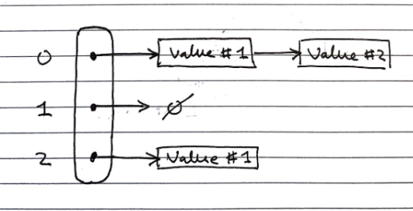

## Maps (ADT)
> **Maps** are a "searchable collection of key-value entries" 
>
> *Data Structures and Algorithms in Java, Goodrich, Tamassia, Goldwasser.*

They cannot contain duplicate keys, as then they would not be able to unambiguously look up values by their keys

Maps have the fundamental operations:
- contains(e)
- get(e)
- put(e)
- remove(e)
- size()
- isEmpty()
- *sometimes additional operations for getting lists of all keys or all values*

There are two common concrete implementations:
- List based implementation
  - $$O(n)$$ lookup and insertion, as the whole list needs to be iterated over to check for duplicates
  - $$O(n)$$ space complexity, as there are no duplicates
- Hash table based implementation
  - $$O(1)$$ lookup and insertion time, as they can be directly indexed
  - $$O(k \cdot n)$$ space complexity (still linear with number of items, but larger by a big constant factor)

## Hash tables

*Concrete implementation*

> **Hash tables** are a time efficient implementation of the Map abstract data type

To look up keys in $$O(1)$$ time, we want essentially want to be able to index an array of them, but the space of keys are far too large to conceivably keep **just** one element in the array for each key.

### Hash functions

We can use a "hash function" to reduce the size of the keyspace, so we can used the hashed outputs of keys for indices in the array storing the map.
$$
h : keys \rightarrow indices
$$
$$h$$ maps keys of a given type to integers in a fixed interval $$[0, N-1]$$ where $$N$$ is the size of the array to store the items in.

Modern implementations of hash functions are **very complicated**, and often involve two phases

1. Mapping keys to integers with a **hash code** $$h_1$$
2. Reducing the range of those integers with a **compression function** $$h_2$$

But simpler ones exist, for example $$h(x) =  x \!\!\mod \!N$$

- We try to pick $$N$$ such that there are fewer collisions – numbers like primes with few factors are better

### Memory address

Java implements hash functions for all objects with the `.hashCode()` method, giving a convenient way to implement hashing.

The `.hashCode()` method is dependent on the memory address of the object storing the key, which is then cast to an integer. This then may be resized using a reduction function to map it to the correct size of the table may still be required.

### Integer cast

Taking the bits encoding the object storing the key, and re-interpreting them as an integer. This is only suitable for keys of fewer or equal to the number of bits in the integer type (i.e. primitives: `byte`, `short`, `int`, `float`)

### Component sum

The process is:

1. Partition the bits of the key into a number of fixed length components (e.g. 8 bits)
2. Sum together the components, discarding overflows

This is suitable for keys of a greater number of bits than the integer type (e.g. `long` and `double`)

### Polynomial accumulation

The process is:

1. Partition the bits of the key into a number of fixed length components (e.g. 8 bits), and name them $$a_0, a_1, ..., a_{n-1}$$ respectively

2. Evaluate the polynomial:
   $$
   p(z) = a_0 + a_1 \cdot z + a_2 \cdot z_2 + ... + a_{n-1} \cdot z^{n-1}
   $$
   at a fixed value $$z$$, ignoring overflows

   This can be evaluated quickly using Horner's rule

This is especially suitable for strings, with $$z=33$$ giving at most $$6$$ collisions from $$50,000$$ English words

### Java hash implementations

Java implements hash functions for all objects with the `.hashCode()` method, giving a convenient way to implement hashing, but a reduction function to map it to the correct size of the table may still be required.

Additionally: "You must override `hashCode()` in every class that overrides `equals()`.  Failure to do so will result in a violation of the general contract for `Object.hashCode()`, which will prevent your class from functioning  properly in conjunction with all hash-based collections, including  `HashMap`, `HashSet`, and `Hashtable`." (*Effective Java*, Joshua Bloch)

## Collisions

> Collisions are when two **different** keys are **mapped to** the **same index** by the hash function. Since we cannot store duplicate keys unambiguously in a map, we need a protocol to resolve this. 

Common approaches to this are

- Separate chaining
- Linear probing
- Double hashing

When colliding items are placed in different cells in the table, it is called "open addressing", and when they are put in a separate data structure it is called closed addressing (with linear probing and separate chaining being examples of both respectively)

### Separate Chaining

In **separate chaining**, each index in the array can contain a reference to a linked list. 

- Whenever a key is mapped to that index, the key-value pair is added to the linked-list. 
- If there are duplicates, we iterate over the chain till we find the key, or reach the end. 

This has the **drawback** of requiring additional memory space for each linked list



*Image source: Data Structures and Algorithms in Java, Goodrich, Tamassia, Goldwasser*

### Linear Probing

> **Linear probing** handles collisions by placing the colliding item in the next available table cell, wrapping around if necessary. 

**Searching**

As with the linked list, **searching** is done by iterating over the next cells, stopping when 

- The item is found
- An empty cell in the table is found
- ***N*** cells have been unsuccessfully (cannot find key) probed.

```c++
// Psuedocode
Algorithm get(k)
    i <- h(k) // h = hash function
    p <- 0
    repeat
    	c <- A[i] // A is the table
    	if c = empty
            return null
        else if c.getKey() = k // We found our item
            return c.getValue()
        else
            i <- (i + 1) mod N // mod N takes care of wrap arounds
            p <- p + 1
   until p = N // stop if we have repeated N times
   return null
```

This has the **drawback** of colliding items "lumping together", which can cause many items needed to be iterated over in a probe.

**Removing**

**To remove** an item, we cannot just set it to null again, as that would mean it stops probing, even though there might be subsequent elements. Instead, we replace it with a `DEFUNCT` element, which is just skipped over when probing.

- Search for an entry with key ***k***
- If ***k*** is found, we replace it with `DEFUNCT` and we return the **value** of the item with key ***k***
- Else we return **null**

When colliding items are placed in different cells in the table, it is called **open addressing**, or **closed hashing**, and when they are put in a separate data structure it is called **closed addressing**, or **separate chaining** (with linear probing and separate chaining being examples of both respectively) [additional link](http://www.iro.umontreal.ca/~nie/IFT1020/Watt/12/tsld009.htm)

### Double Hashing

> **Double hashing** handles collisions by re-hashing the key with a new hash function
>
> If cell $$h(k)$$ is occupied and not our key, we try $$[h(k) + i \cdot f(k)] \!\!\mod \!N, \; i \in \mathbb{Z}$$
>
> - $$h$$ and $$f$$ are hashing functions, and $$f(k)$$ cannot have 0 values. 
> - $$N$$ must be a prime to allow probing of all cells.

As before, there are many implementations of the hash function, but $$f(k)= q-k \!\!\mod\!q, \;s.t.\;  q<N, q \in primes$$ is normally used.

- If $$f(k) = 1$$ then we have **linear probing**.

**Searching** is similar to linear probing, but when iterating we look at the hash value for $$i = 1,2,3,\ldots$$ rather than just the next index in the table. This helps avoid the issue of colliding items "lumping together" as in linear probing.

## Resizing a hash table

As with arrays, we create a new table of a larger size, then iterate over every index in the table, and apply the standard add operation to add it to the new one (re-hashing).

Again, similarly to arrays, the new size of the table can be picked from various algorithms, most commonly constant or exponential growth.

## Performance of Hashing

The load factor of a hash table is the ratio of the number of items it contains to the capacity of the array $$\alpha = \frac{n}{N}$$.

- If this approaches $$1$$, the table becomes time inefficient to lookup in, so we often re-size the table whenever it exceeds a certain value, e.g. $$0.75$$
- If this approaches $$0$$, then the table is mostly empty, so is space inefficient, so we try to avoid tables of less than a certain value, e.g. $$0.5$$

The time complexity of insertion and lookup is:
- $$\Theta(1)$$ best case
- $$O(n)$$ worst case – when all keys inserted into the map collide
- "Expected" number of probes with open addressing is $$\frac{1}{1-\alpha}$$

In practice, hash tables are a very efficient implementation of maps assuming the load factor is not very close to $$1$$

<blockquote class="extra" markdown="span">
    Experiments show that as long as $$\alpha \lt 0.9$$, there should be no problem with speed.
    However, for $$\alpha \gt 0.9$$ the number of collisions increase and becomes slower.
</blockquote>

## Sets (ADT)

> **Sets** are "an **unordered** collection of elements, **without duplicates** that typically supports **efficient membership tests**." 
>
> *Data Structures and Algorithms in Java, Goodrich, Tamassia, Goldwasser*

These are the same as sets in mathematics.

*If you want to pull request more stuff here, please do - but I'm not too sure how much more depth is needed*

| Fundamental Operations | Description                                                  |
| ---------------------- | ------------------------------------------------------------ |
| `add(e)`               | Adds the element *e* to *S* (if not already present)         |
| `remove(e)`            | Removes the element *e* from *S* (if it is present).         |
| `contains(e)`          | Returns whether *e* is an element of *S*                     |
| `iterator()`           | Returns an iterator of the elements of *S*                   |
| `union(s2)`            | Updates *S* to also include all elements of set *T*. This effectively replaces *S* with *S* &cup; *T* |
| `intersection(s2)`     | Replace/Update *S* with *S* &cap; *T*                        |
| `difference(s2)`       | Replace/Update *S* with *S* – *T*  (set minus)               |

And alternate definition for set operations can instead define a third set structure and fill it with the result of *S* \*set operation\* *T* – this way we don’t alter *S*

- union(s1, s2)
- intersection(s1, s2)
- difference(s1, s2)

## Implementations

There are two common concrete implementations. These are essentially the same as for maps, however, the key and the value are taken to be the same.

- Linked lists
- Hash set

### List based

> In the list implementation we store elements **sorted** according to some canonical ordering. This is **important** for the set operations to be more time efficient.

Generally, the **space complexity** is $$O(n)$$, without overhead of empty cells. Since sets are not indexable, linked lists can be used, **offering efficient re-sizing**.

We need to iterate over each element in the list to lookup items, $$O(n)$$ time complexity, which is not efficient, but for most more complex set operations, this becomes less of a drawback.

#### Generic Merging Algorithm

Set operations can be implemented using a generic **merge** algorithm.

```c++
Algorithm genericMerge(A,B)
    S <- empty set // Set S to be an empty set
    while !A.isEmpty() and !B.isEmpty() // until either 1 is empty
        a <- A.first().element(); b <-  B.first().element
        if a < b
            aIsLess(a, S); A.remove(A.first())
        else if b < a
            bIsLess(b, S); B.remove(B.first())
        else // b == a
            bothAreEqual(a, S)
            A.remove(A.first()); B.remove(B.first())
    // By this point either A is empty or B is empty
    while !A.isEmpty() // populate S with remaining elements in A, if any
        aIsLess(a, S); A.remove(A.first())
    while !B.isEmpty() // Same for B as with A
        bIsLess(b, S); B.remove(B.first())
    return S
```

❕❗ This merging algorithm is used in **merge sort** as well! You may have noticed that we have 3 auxiliary methods in this algorithm: `aIsLess`, `bIsLess`, and `bothAreEqual`.

> Depending on the set operation (or any operation you are using this generic merge for), you define these methods **differently**. 
>

**Example.**

For **set intersection** – we only want the algorithm to merge when `b == a`, so `aIsLess` and `bIsLess` should do **nothing** and `bothAreEqual` should add either one into ***S***. 

**Set union** is trivial (just add everything).

For **set subtraction** you do nothing if the elements are equal! 

This means that each **set operation** runs in **linear time** (i.e $$O(n_A + n_B)$$ time), provided that the auxiliary methods run in *O(1)* time. This is **possible**, as we know that the **elements are sorted**.

### Hash-set based

Hash-sets are implemented like a hash-table, but using only keys, not key-value pairs. This gives fast $$O(1)$$ lookups, and an $$O(n)$$ space complexity, but with large overheads.
