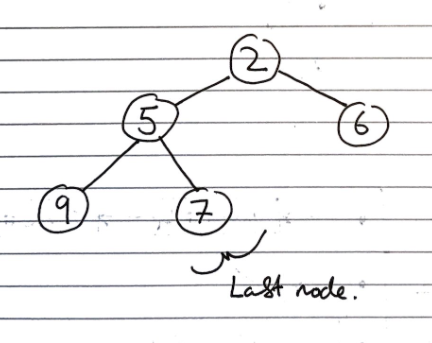
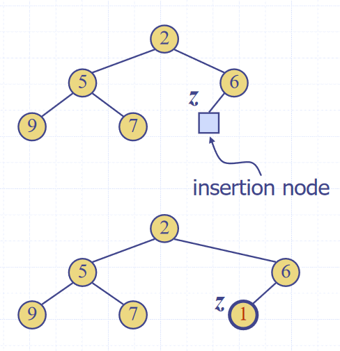

# Heaps (ADT)
**Heaps** are essentially binary trees storing keys at their nodes and satisfying a set of "heap properties".

As such, they are implemented in the same way as binary trees, discussed earlier, but with modified internal behaviour when inserting and deleting elements

## Heap properties

The properties a binary tree must fullfil to be a heap are:

- Heap-order, for every internal node other than the root (as it has no parent), the value of the node is greater than the value of the parent node
- Complete binary tree, the height of the tree is minimal for the number of the nodes it contains, and is filled from "left to right". This is formally defined as:
  > Let $$h$$ be the height of the heap
  >
  > ​	Every layer of height $$i$$ other than the lowest layer ($$i = h-1$$) has $$2^i$$ nodes
  >
  > ​	In the lowest layer, the all internal nodes are to the left of external nodes
- The last node of the heap is the rightmost node of maximum depth

Image source: *Data Structures and Algorithms in Java*, Goodrich, Tamassia, Goldwasser


## Heap methods

### Inserting into a heap

First, the element is inserted to its temporary position of the rightmost node of maximum depth, so that it fills from left to right, with a running time of $$O(1)$$ time, if a pointer to the position to insert is maintained

Image source: *Data Structures and Algorithms in Java*, Goodrich, Tamassia, Goldwasser

Then, the "upheap" algorithm is run to re-order the heap so that it fulfils the heap properties. This algorithm repeatedly swaps the inserted node with its parent, until either it reaches the root node, or it is larger than the parent node:

```
Let k <- the element to insert
While k is smaller than its parent, and k is not the root node
	Swap the values of k and its parent node
```


Image source: *Data Structures and Algorithms in Java*, Goodrich, Tamassia, Goldwasser


### Removal from a heap

The smallest item in the heap is the root node, so this value is stored and returned. However, we need to maintain heap properties as it is overwritten.

First, the value of the root node is overwritten with the value of the last node, and the last node is removed from the tree:

Image source: *Data Structures and Algorithms in Java*, Goodrich, Tamassia, Goldwasser


Then the "downheap" algorithm is run to re-order the heap so that it fulfils the heap properties:
```
Let p <- the root node
Let c <- the child of p with the minimal key (right if existent, otherwise left)
If the value of p is less than or equal to the value of c
	Stop, since the heap order property is fulfilled
Else
	Swap the values of p and c
	Run the downheap algorithm again with the root node (p) now as the child node (c)
```

Image source: *Data Structures and Algorithms in Java*, Goodrich, Tamassia, Goldwasser

As with upheap, since the heap has a height of $$O(log_2\ n)$$, performing a swap takes $$O(1)$$ time, and the maximum number of swaps is the height of the heap, the downheap algorithm takes $$O(log_2\ n)$$, time


## Performance

Since the heap has a height of $$O(log_2\ n)$$, performing a swap takes $$O(1)$$ time, and the maximum number of swaps is the height of the heap, the upheap algorithm takes $$O(log_2\ n)$$, time. In total, insertion takes $$O(log_2\ n)$$, time


## Use in sorting

Since the heap can be used to implement priority queues, it can be used for sorting as with list based implementations, which resulted in selection and insertion sort. This is called a heap sort.

The steps taken in heap sort are:
1. Enqueue $$n$$ elements, with each enqueueing taking $$O(log n)$$ time, so the total time is $$O(n \cdot log n)$$ time
2. Dequeue all $$n$$ items, with each Dequeuing taking $$O(log n)$$ time, so the total time is $$O(n \cdot log n)$$ time
Hence, the total time complexity is $$O(n \cdot log n)$$ 

This is one of the fastest classes of sorting algorithm, and is much more efficient than insertion or selection


## Concrete implementations

- Concrete implementations
  - Any tree implementation can be used for a heap, as it merely modifies the way getters and setters work, not the internal data structures
  - The main draw-back of array based implementations of space inefficiency for unbalanced trees is a non-issue for heaps, as they are implicitly balanced, so they are often used