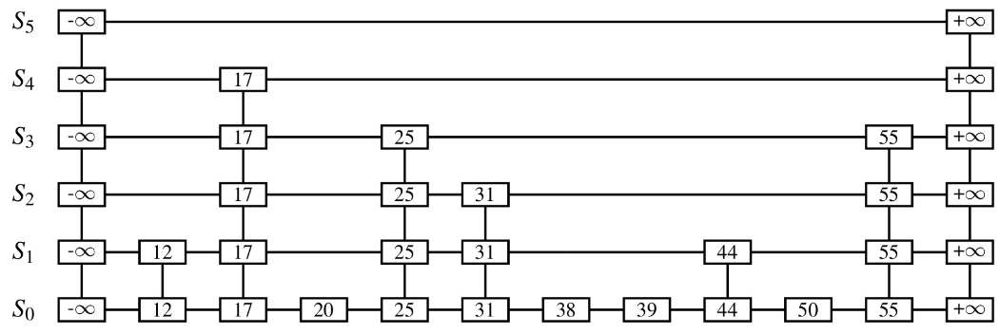
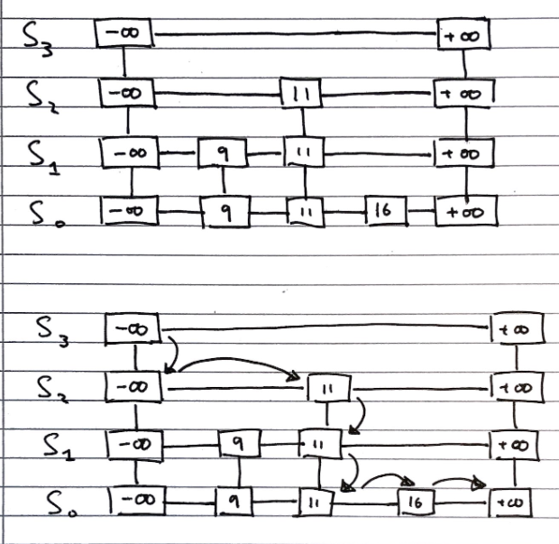
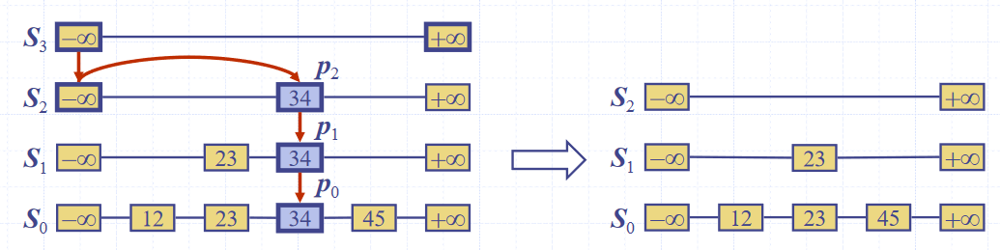
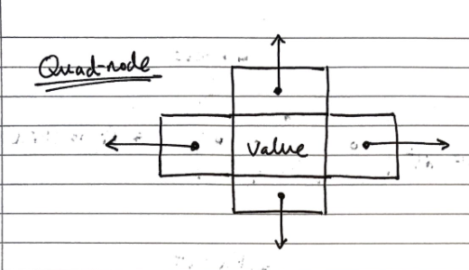

## Motivations for skip lists

We want to be able to efficiently implement both searching, and insertion and deletion

For fast searching, we need the list to be sorted, and we have come across two concrete implementations of lists, but neither of which fulfil both of  these goals.

- Sorted arrays
  - Easy to search using binary search, since they are not indexable, needs $$O(log\ n)$$ time
  - Difficult insert/delete from, as elements need to be "shuffled up" to maintain ordering, needs $$O(n)$$ time
- Sorted lists
  - Easy to insert/delete from, assuming the position is known, needs $$O(1)$$ time
  - Difficult to search, since they are not indexable, needs $$O(n)$$ time

## Skip Lists (ADT)

**Skip lists** are composed from a number of sub-lists, which act as layers within them, which we denote by the set $$S = \{S_0, S_1, ..., S_h\}$$ where $$h$$ denotes the number of layers in the list, i.e. its "height"

- All lists have a guard values $$+ \infty$$ and $$- \infty$$ at either end, and all the elements are in order between those values

- The "bottom" list, $$S_0$$ contains all the values in order between the guards

- The "top" list, $$S_h$$, contains only the guard values, $$+ \infty$$ and $$- \infty$$

- Each list $$S_i$$ for $$0 < i < h$$ (i.e. everything bar the top list, which contains only the guards, and the bottom list, which contains all elements) contains a random subset of the elements in the list below it, $$S_1$$

- The probability of an element in $$S_i$$ being in the list above it, $$S_{i+1}$$, is $$0.5$$

  

A diagram of the structure of a skip list is shown below



## Searching

To search for an value `v​` in a skip list, we follow the algorithm

```java
Algorithm search(k):
  p <- skiplist.first() // this is the minus-infinity guard of the top list
  Repeat
    e <- p.next().element()
    if e.key() == k
      return e
    else if e.key() > k // next element is greater than v
      p <- p.below()    // Drop Down Step
      if p == null then return null
    else                // next element's key is smaller than v
      p <- p.next()     // Scan Forward Step
```



## Inserting

To insert a value `v`​ into a skip list, we follow the algorithm.

```java
i <- number of flips of a fair coin before a head comes up
If i >= height of skip list
  Add new, empty, sub-lists {S(h+1), ..., S(i+1)} to S 
Using the search algorithm, we find v //even though we know it is not inserted
  For every dropdown step, store the position of the element in an array
	// This array stores the positions p(0) to p(i) of the 
  // largest element lesser than v of each sublist S(j)
For each sublist from 0 to i
	Insert v into S(j) immediately after the position p(j) in array
```


## Deleting

To delete a value `v`​ from a skip list, we follow the algorithm

```java
Using search algorithm, find v in skiplist
  Once found at position p,
    while p.below() != null
      hold <- p
      delete(p) // Delete v from sublists below
      p <- hold
Remove all but one list containing only guards from the top of the skip list
```



## Implementation

We can use "quad-nodes", which are similar to those used in linked lists, but with four pointers, instead of just one to store the entry, and links to the previous, next, below and above nodes:



Additionally, there are special guard nodes, with the values $$+ \infty$$ and $$- \infty$$, and fewer pointers, as they don't have adjacencies on one side.

## Performance

### Space usage

Dependent on randomly generated numbers for how many elements are in high layers, and how high the layers are.

We can find the **expected number of nodes** for a skip list of $$n$$ elements:

> The probability of having $$i$$ layers in the skip list is $$\frac{1}{2^i}$$.
>
> If the probability of any one of $$n$$ entries being in a set is $$p$$, the **expected size** of the set is $$n \cdot p$$
>
> Hence, the expected size of a list $$S_i$$ is $$\frac{n}{2^i}$$
>
> This gives the expected number of elements in the list as $$\sum_{i=0}^{h}(\frac{n}{2^i}),$$ where $$h$$ is the height.
>
> We can express this as $$n \cdot \sum_{i=0}^{h}(\frac{1}{2^i}) \lt 2n$$, and with the sum **converging** to a **constant factor**, so the **space complexity** is $$O(n)$$.

### Height

The height of a skip list of $$n$$ items is **likely** to (since it is generated randomly) have a height of order $$O(log\ n)$$.

We show this by taking a height logarithmically related to the number of elements, and showing that the probability of the skip list having a height greater than that is very small.

> The probability that a layer $$S_i$$ has at least one item is at most $$\frac{n}{2^i}$$
>
> Considering a layer logarithmically related to the number of elements $$i = 3 \cdot log\ n$$
>
> The probability of the layer $$S_i$$ has at least one entry is at most $$\frac{n}{2^{3 \cdot log\ n}} = \frac{n}{n^3} = \frac{1}{n^2}$$
>
> Hence, the probability of a skip list of $$n$$ items having a height of more than $$3 \cdot log\ n$$ is at most $$\frac{1}{n^2}$$, which tends to a negligibly small number very quickly.

### Search time

The search time is **proportional** to the number of steps scan forward and drop down steps. 

> In the worst case, both dimensions have to be totally traversed, if the item is both bigger than all other items, or not present.
>
> The number of **drop down steps** is **bounded** by the height so it is **trivial** to see that it is $$\approx O(log\ n)$$ with high probability, 
>
> To analyse the scan-forward step, firstly [recall](#skip-lists-adt) that given an item in sub-list $$i$$, its probability of being in sub-list $$(i-1)$$ as well is &frac12;. 
>
> Let’s say that we scanned $$n_i$$ keys at sub-list $$i$$ before we dropped down a level to $$(i -1)$$. Each subsequent key that we **scan forward to** cannot exist in $$(i-1)$$, otherwise we would have already seen it.
>
> A probabilistic fact is that the **expected** number of keys we will encounter at $$(i-1)$$ is 2 which is an $$O(1)$$ operation per sub-list. [Why?](#expectation-explanation)
>
> Hence, the expected number of scan forward steps in **total** is $$O(log\ n)$$ because the number of sub-list is the height of the skiplist.

Hence, the total **search time** is $$O(log\ n)$$.

### Update time

Since the insert and delete operations are both essentially wrappers around the search operation, and all of their additional functionality is of $$O(log\ n)$$ or better, the time complexity is the same as the search function

### Expectation Explanation

*FYI ONLY.* The source of this explanation is by [JMoravitz on Stack Exchange](https://math.stackexchange.com/questions/1196452/expected-value-of-the-number-of-flips-until-the-first-head) (Accessed 16 May 2021)

> Let X be a **discrete random variable** with possible outcomes: 
>
> $$x1,x2,x3,…,xi,…$$ with associated probabilities $$p1,p2,p3,…,pi,…$$
>
> The **expected value** of $$f(X)$$ is given as: $$E[f(X)] = \sum\limits_{i\in\Delta} f(x_i)p_i$$

For our example, we are examining the number of items we expect to see in both sub-list $$i$$ and $$(i-1)$$. 

Hence, $$X$$ could be $$1,2,3,\ldots,n$$ with corresponding probabilities $$\frac{1}{2},\frac{1}{4},\frac{1}{8},\dots,\frac{1}{2^n}$$

So, the expected value of $$X$$ is: $$E[X] = \sum\limits_{i=1}^n i(\frac{1}{2})^i$$. As $$n\rightarrow \infty$$, $$E[X] \rightarrow 2$$. 

This is a well known infinite sum of the form $$\sum\limits_{i=1}^\infty i p (1-p)^{i-1}=\frac1p$$

To prove this:

$$
\sum\limits_{i=1}^\infty i p (1-p)^{i-1} = p\sum\limits_{i=1}^\infty i (1-p)^{i-1}\\
= p\left(\sum\limits_{i=1}^\infty (1-p)^{i-1} + \sum\limits_{i=2}^\infty (1-p)^{i-1} + \sum\limits_{i=3}^\infty (1-p)^{i-1} + \dots\right)\\
= p\left[(1/p)+(1-p)/p+(1-p)^2/p+\dots\right]\\
= 1 + (1-p)+(1-p)^2+\dots\\
=\frac{1}{p}
$$
