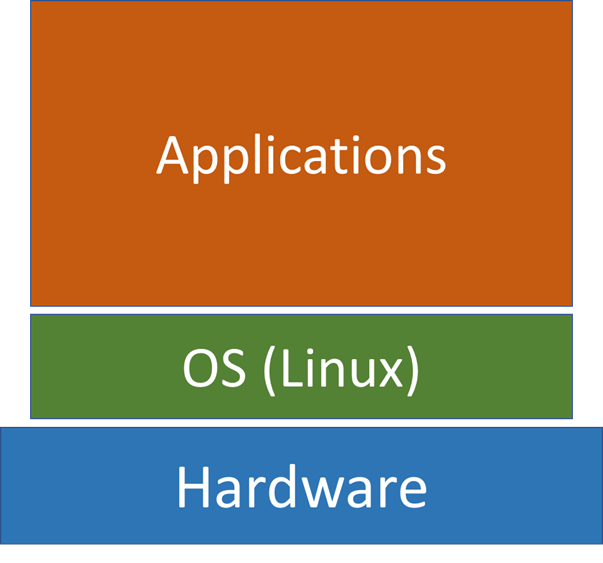
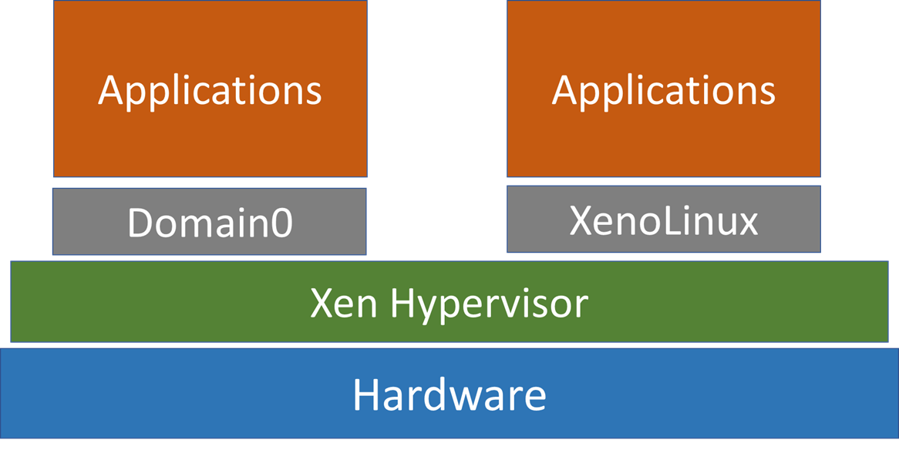

Virtualization technology allows multiple operating systems to share a computer – a running instance of an operating system is called a <b>Virtual Machine</b>

## Introduction to Virtualization

**Terminologies.**

- Host Machine – physical machine VM is running on
- Host OS – OS in the host machine
- Guest OS – OS in the VM

### Architecture of a Physical Machine

> The OS sits between the hardware and its applications and manages the interaction between application and hardware resources. It is the **lowest level software** in a machine.

### Virtualization Architecture

#### Embedded

In an embedded architecture, the hypervisor sits in between guest OSes and hardware. Each grey box is called a domain and is a VM – they are managed by the hypervisor. 

**Properties of Domain0** in Xen

- Domain0 is able to manage and control other guest domains
- Domain0 contain device drivers to access hardware, guest domains cannot access hardware
  - When guest domains want to request access to hardware, they are routed to Domain0. 
  - Multiple guest domains share resources with other guest domains (resources are virtualized).
- Can interact with other VMs

#### Non-embedded

Hypervisor runs as an application to host OS e.g. QEMU.

> These type of systems use a technique called **dynamic binary translation** technique. This translates an instruction issued in Guest OS to an instruction that can run in the host OS.
>
> This is also why non-embedded architectures are slower than embedded, because every instruction has to be **translated**.

### Abstract of Physical Resources

Inside the **hypervisor**, hardware is simulated as files – virtual disk (vDisk), virtual CPU (vCPU), virtual memory (vRAM). 

- These files are transferred to real hardware when necessary
- This is why in the coursework we create a `.cow` file for **QEMU**

### Life cycles of VMs

In a normal physical machine, you can be in 3 states: **Off**, **Running**, or **Suspended** (Sleep).

In VMs, you have an additional state: **Paused**

- VM is still resident in the host machine but not allocated CPU. 
- When multiple VMs are resident, only 1 VM is allocated CPU at a time (running on the physical machine), other VMs will be paused.

## Impact of Virtualization on Security

Below are a list of properties of VMs, and their impact on security.

### Isolated

In a traditional multi-user OS, all user in the computer can be affected by an attack

In virtualisation, each guest OS is encapsulated and hardware is abstracted

- Each VM accesses separate file systems and memory blocks

Ideally a VM compromised by attackers will not affect the host or other VMs on the host

Isolation and abstraction of VMs provides an additional security over traditional multi-user computers

### Transient

Physical servers are often always on while VMs can be started very quickly and remotely

> Typically VMs are turned on only when they are needed, and turned off when they are not used anymore
>
> Limiting operating time of VMs mitigates security risks because we can only infect a machine (physical or virtual) that is on.

**However. It is a double edged sword.**

When virus hits **conventional** networks of physical machines, administrators often do the following 

- Identify which machines are infected
- Clean up infected machines
- Apply security patches to prevent re-infection

> In virtualised environments, infected VMs may appear briefly and disappear before they can be detected making it **difficult to identify which VMs are infected**.
>
> When performing patch management, virus and vulnerability scanning, the machines must be on. Because VMs are transient and not always on – **difficult to fix the vulnerability of infected VMs**.
>
> The infected VMs may appear online briefly, infect other VMs and disappear offline before they are noticed making it **difficult to eradicate the infection in the system.**

As a result, in virtualisation environment worm/virus infections tend to persist at a low level and flare up again at another time.

### State Restoring

> The virtual disk for a VM is stored as a file on the hypervisor. This allows the hypervisor to record changes to the contents of the virtual disk.
>
> - It is easy for VMs to restore to previous states.
>
> - State restore provides a virus removal mechanism for infected VMs and helps ensure data integrity.

**However,** if the hypervisor is compromised then it doesn’t work, and attackers have unlimited freedom and access to the hardware. (Limitation)

**Additionally,** since it is easy to restore infected VMs many users do not have the urge to secure their VMs with virus protection

- 60% of VMs in production are less secure than their physical counterparts, due to this factor

#### Security Patches

In physical machines, when a new **security patch** is applied, the machines remain patched. A VM may also get the security patch, but if the user rolls back to a previous state, then the guest OS is no longer patched. It is **challenging** for system administrators **to apply security patch** in VMs because they have to 

- record when patches have been applied
- evaluate which patches need to be applied again when a VM is restored to a previous state

> Furthermore, rolling back a VM may **expose vulnerabilities**
>
> - re-expose patched vulnerabilities or virus
> - re-enable accounts or passwords that have been disabled
> - reuse encryption keys/tokens that have been deleted. 

#### Data Lifetime

> A fundamental principle for building secure systems is minimising the amount of time that sensitive data remains in a system

In virtualised system, all changes are **recorded**, which **undermines** the principle. Moreover, the state changes will be transferred to persistent storage, which again break the security principle. 

### Low Privilege

In a physical computer, OS is the software that has the highest privilege in the computer

- OS can only be monitored by itself in a physical machine
- If the OS is infected with virus, it cannot be trusted. (Not reliable)

A VM has lower privilege than the hypervisor.

- VMS can be monitored by either the hypervisor, or by an authorised dedicated VM (Domain0)
  - The latter is preferred method since it helps keep the hypervisor simple
  - The hypervisor gives the dedicated VM the permission to view resources allocated to the monitored VM.

#### Security Patch

In physical machines, when a new security patch is applied, the machines remain patched ,

A VM may also get the security patch, but if the user rolls back to a previous state, then the guest OS is no longer patched

Therefore, it is very challenging for system administrators to apply security patch in VMs because they have to 

- record when patches have been applied
- evaluate which patches need to be applied again when a VM is restored to a previous state

### Mobile

VMS are not physical, everything about a VM is virtualised as files – makes **theft** of data easier.

In fact, attackers can access copies of VM that are located on the **physical disk** of the host machine. Because the Guest OS has no access to that disk, the VM will not show any records of intrusion.

> Being **offline** does not guarantee safety. An attacker can access and modify VM files while the VM is offline. A physical machine must be running to be susceptible. 

### Easy to Create

In a traditional network of physical machines, all machines have same configurations. 

- When there are security vulnerabilities, the same security measure can be applied to all machines

> VMs can be created rapidly, each with a unique configuration (VM Sprawl)
>
> - Cannot apply a uniform security measure to all VMs
> - The rapid growth of VMs exceeds the administrators’ ability to secure each unique VM

### Lack of Identity

In a traditional environment, a machine can be identified by MAC address, Ethernet port number. It is used as a mechanism of non-repudiation – the system has the mechanism to check who did something.

> In a virtualised system , there is **only one** physical MAC address and a Port number, **but multiple** VMs are running so we cannot use MAC or ethernet port number for **non-repudiation** anymore.

## Other Security Issues

### Hypervisor Intrusion

> If the hypervisor is compromised, the attacker can access all the VMs.

For non-embedded hypervisor, the hypervisor is a program, running on the host OS

- If it is compromised, all VMs can be accessed
- The host OS will be in danger as well, as the hypervisor converts instructions (dynamic binary translation) for the guest OS into instructions for the host OS
  -  This means he instructions sent by hypervisor **can no longer be trusted** as it could be malicious. 

### Security due to Inter-VM communication

> “VM-to-VM” attacks means that attackers user one VM to access or control other VMs on the same hypervisor. 

Attacks can be achieved by inter-VM communication. A malicious VM can potentially access other VMs because all VMs share resources (memory, network connections etc.) on the hypervisor. 

*One example is with the embedded architecture of virtualization.* 

Domain0 is connected to all guest domains and inter-VM communication happens through the hypervisor. An attack on the **shared memory segment** of the hypervisor can use 1 VM to attack another VM.

### Denial of Service

> An **improperly configured** hypervisor can allow a **single VM** to consume all resources, starving other running VMs.

However, the solution to this is **simple**. Hypervisors should prevent any VM from gaining 100% usage of any resources. 

