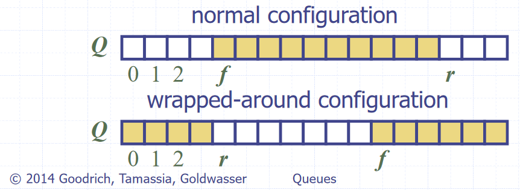

# Stacks (ADT)
- A "Last in, first out" (LIFO) data structure - both insertions and deletions occur at the front of the stack
- Two fundamental operations
  - push(e), pop(), size(), isEmpty()
- Edge case of popping from an empty stack, normally either returns null or throws an error
- Array based implementation  **(Concrete)**
  - Index of head stored, and incremented/decremented on pushing/popping operations
  - $$O(n)$$ space complexity
  - $$O(1)$$ time complexity of fundamental operations

# Queues (ADT)
- A "First in, first out" (FIFO) data structure - insertions occur at the rear and removals at the front of the queue
- Fundamental operations
  - enqueue(e), dequeue(), size(), isEmpty()
- Edge case of dequeuing from an empty queue, normally either returns null or throws an error
- Array based implementation **(Concrete)**
  - Uses and array with data wrapping around as it is added and removed. Both the index of the head $$f$$ **and** the size of the queue $$s$$ need to be stored
  - The rear of the queue (index to next insert to) is $$(f + s)\ MOD\ N$$, with $$N$$ as the array size
    
    Image source: *Data Structures and Algorithms in Java*, Goodrich, Tamassia, Goldwasser
  - $$O(n)$$ space complexity
  - $$O(1)$$ time complexity of fundamental operations
