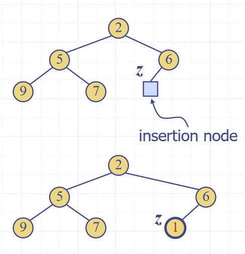
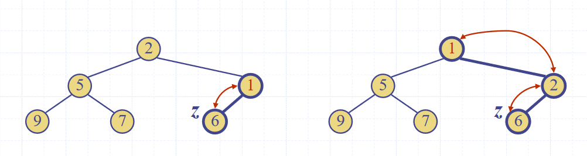

# Heaps (ADT)
- A heap is a binary tree storing keys at its nodes and satisfying the following properties:
  - Heap-order, for every internal node other than the root (as it has no parent), the value of the node is greater than the value of the parent node
  - Complete binary tree, the height of the tree is minimal for the number of the nodes it contains, and is filled from "left to right". This is formally defined as:
    > Let $$h$$ be the height of the heap
    >
    > ​	Every layer of height $$i$$ other than the lowest layer ($$i = h-1$$) has $$2^i$$ nodes
    >
    > ​	In the lowest layer, the all internal nodes are to the left of external nodes
  - The last node of the heap is the rightmost node of maximum depth
  
  Image source: *Data Structures and Algorithms in Java*, Goodrich, Tamassia, Goldwasser
- Heaps can be used to implement priority queues
- Inserting into a heap
  - First, insert the element to its temporary position of the rightmost node of maximum depth, so that it fills from left to right, running in $$O(1)$$ time, if a pointer to the position to insert is maintained
    
    Image source: *Data Structures and Algorithms in Java*, Goodrich, Tamassia, Goldwasser
  - Run the "upheap" algorithm to re-order the heap so that it fulfils the heap properties
    - Repeatedly swap the inserted node with its parent, until either it reaches the root node, or it is larger than the parent node
    
    Image source: *Data Structures and Algorithms in Java*, Goodrich, Tamassia, Goldwasser
    - Since the heap has a height of $$O(log_2 n)$$, performing a swap takes $$O(1)$$ time, and the maximum number of swaps is the height of the heap, the upheap algorithm takes $$O(log_2 n)$$, time
  - In total, insertion takes $$O(log_2 n)$$, time
- Removal from a heap
  - The smallest item in the heap is the root node, so this value is stored and returned. However, we need to maintain heap properties as it is overwritten
  - First, overwrite the value of the root node with the value of the last node, and remove the last node from the tree
    
    Image source: *Data Structures and Algorithms in Java*, Goodrich, Tamassia, Goldwasser
  - Run the "downheap" algorithm to re-order the heap so that it fulfils the heap properties
    ```
    Let p <- the root node
    Let c <- the child of p with the minimal key (right if existent, otherwise left)
    If the value of p is less than or equal to the value of c
    	Stop, since the heap order property is fulfilled
    Else
    	Swap the values of p and c
    	Run the downheap algorithm again with the root node (p) now as the child node (c)
    ```
    
    Image source: *Data Structures and Algorithms in Java*, Goodrich, Tamassia, Goldwasser
  - As with upheap, since the heap has a height of $$O(log_2 n)$$, performing a swap takes $$O(1)$$ time, and the maximum number of swaps is the height of the heap, the downheap algorithm takes $$O(log_2 n)$$, time
- Since the heap can be used to implement priority queues, it can be used for sorting as with list based implementations, which resulted in selection and insertion sort. This is called a heap sort
  - The steps taken in the sort are:
    1. Enqueue $$n$$ elements, with each enqueueing taking $$O(log n)$$ time, so the total time is $$O(n \cdot log n)$$ time
    2. Dequeue all $$n$$ items, with each Dequeuing taking $$O(log n)$$ time, so the total time is $$O(n \cdot log n)$$ time
    Hence, the total time complexity is $$O(n \cdot log n)$$ 
  - This is one of the fastest classes of sorting algorithm, much more efficient than insertion or selection
- Concrete implementations
  - Any tree implementation can be used for a heap, as it merely modifies the way getters and setters work, not the internal data structures
  - The main draw-back of array based implementations of space inefficiency for unbalanced trees is a non-issue for heaps, as they are implicitly balanced, so they are often used
