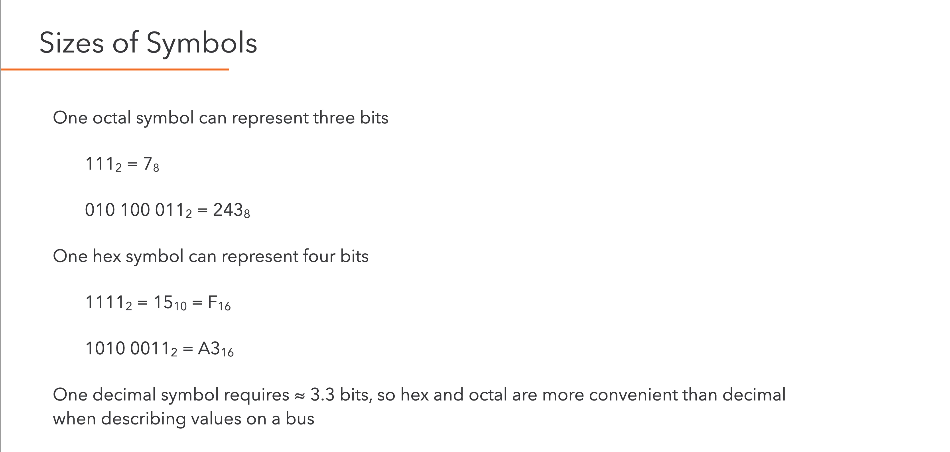
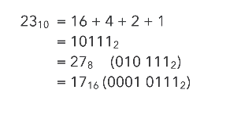

# Data Representation

Types of representation

- Tally marks
- Roman Numerals
- **Decimal Integers** - Base 10 
- Fractions
- Scientific
- **Binary** - Base 2
- **Octal** - Base 8
- **Hexadecimal**  - Base 16

> **One value, many representations.** A representation is a way of using or describing a value, for example 1010~2~ and 10~10~ all denote the same value.

## Why do we use Binary?

Mainly because 0s and 1s provide the greatest degree of distinction for voltage levels which gives us **noise immunity**.

### What is Noise Immunity?

In *TTL (transistor-transistor logic)*, different voltage levels represents a different value in binary for that particular transistor. Usually, $$0V-0.8V$$ represents $$0$$, and $$2.4V-5V$$ represents $$1$$.

> These are ranges are governed by the tolerance of the electrical components and can be affected by *noise* that makes the voltage fluctuate. Hence there is a “divide” between the 2 ranges to provide a separation for the signal, in order to properly distinguish between a $0$ or $1$. 
>
> Otherwise, if the cut-off point was just at a particular voltage, e.g. $$3V$$, then if it is at $$2.9V$$ the transistor will not know if it is a $$0$$ or a $$1$$ because there will be fluctuations (noise).

### Bits, Bytes, Words, and Bus Sizes

Bit - Binary Digit (values 0~2~ or 1~2~ inclusive).

Byte - 8 bits (0 to 255)~10~

Word - The number of bits a machine can process simultaneously

4 bits = half a byte = nibble 

**MSB** (most significant bit) and **LSB** (least significant bit), usually the leftmost and rightmost bit respectively. There are exceptions when you want to flip it around, and that should in such cases you should explicitly state which bit you are referring to.

# Conversion

One disadvantage of binary is that it is **not** a very **compact** way of representing values. So for representing larger values for humans, we usually use octal or hexadecimal, why? because...

*It is easier to convert from binary to octal or binary to hexadecimal than from binary to decimal* 

## Converting from Decimal to Binary

Repeatedly divide the number by the base required, i.e 2 for binary, and record the remainder for each division. Once you’re done, write out the remainders from quotient 0 to the original number (in this case right to left) and you will arrive at the binary representation of your original number.

| Quotient      | 163  | 81   | 40   | 20   | 10   | 5    | 2    | 1    |  0   |
| :-----------: | :--: | :--: | :--: | :--: | :--: | :--: | :--: | :--: | :--: |
| **Remainder** | -    | 1    | 1    | 0    | 0    | 0    | 1    | 0    |  1   |

$$
163_{10} = 1010 \;0011_2
$$

### Decimal to Octal or Hex

The same division method can be used…but it might be easier to convert to binary first and then into the required base:

You can do this unless Matt prohibits it in exam. 

### Addition and Negative Numbers

##### Addition

To do addition in binary it's just like long division, sum the numbers, and carry over the 1 if there it adds to 2. For *subtraction* you add negative numbers (Two's complement) and it is the exact same, just that you ignore any overflow.

##### Signed Magnitude Representation

The MSB is an indicator of whether the number is negative. 1 is negative, 0 is positive. There's a problem when you think about 0. What is +0 vs -0?

##### Two's Complement Representation

The MSB has the same value as in the binary positional representation but it is negative.

*Why TC?*

The range is asymmetric, there are more negative numbers than positive as the MSB is negative. And because of this, it removes the unique zero. 

###### Forming Two's Complement

### Fractional Numbers

##### Fixed Point Representation

For fractions, we introduce negative powers. 2.75~10~ = 10.11~2~

However, if the number is 2.8, fixed-PR will not be very good because there will be a problem with representation. It will be a very long number and will require a lot of bits.

##### Floating Point Representation

Scientific notation allows small and large values to be written succinctly.

$3 \times 108 m/s = 299,792,458 m/s$

Floating point uses the same principles as scientific notation. It expresses numbers as a (mantissa x 10^exponent^), where the mantissa represents the detail of the value to a certain precision. The exponent represents the magnitude of the value.

###### IEEE Floating Point

IEEE standard 754 is widely used and specifies levels of binary precision

- Single precision (32 bits)
  - 1bit for the sign, 8bits for the exponent, and 23 bits for the mantissa (m)
- Double precision (64 bits)
- Quad precision (128 bits)