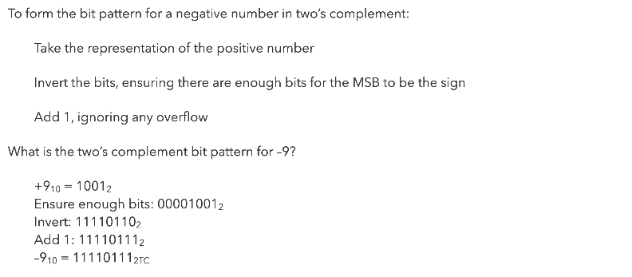
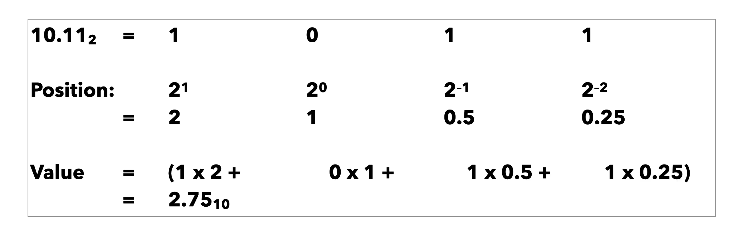

# Data Representation

## Representation and number systems

In terms of the exam, the most important concept is **value versus representation** of any number. In practice, this means you need to accept that you cannot always represent a value across different bases using the same number of symbols.

> **One value, many representations.** A representation is a way of using or describing a value, for example $$1010_2$$ and $$10_{10}$$ denote the same value.

There are four main number systems we will use:

| Number system | Symbols | Base |
|---------------|---------|------|
| Binary        | `0`, `1` | 2 |
| Octal         | `0`, `1`, `2`, `3`, `4`, `5`, `6`, `7` | 8 |
| Decimal       | `0`, `1`, `2`, `3`, `4`, `5`, `6`, `7`, `8`, `9` | 10 |
| Hex           | `0`, `1`, `2`, `3`, `4`, `5`, `6`, `7`, `8`, `9`, `A`, `B`, `C`, `D`, `E`, `F` | 16 |

It is crucial that you learn to distinguish between representations of these numbers – for example, 1610 = 100002 = 208 = 1016.

For any number system, you can use the following equation to calculate the value of a number: 
$$
\text{value = (sum from } i = 0\text{ to } i = (N-1))\text{ symbol}(i) \times \text{base}^i
$$

### Sizes of symbols
As the base increases, we can see that a single symbol can represent bases more concisely than in other bases – take the following examples:
- Octal symbols can represent 3 bits:
  - 1112 = 78
  - 010 100 0112 = 2438
- Hex symbols can represent four bits:
  - 11112 = 1510 = F16
  - 1010 00112 = A316

A decimal symbol requires roughly **3.3 bits**, and therefore hex and octal are much more convenient when describing values on a bus.

## Why do we use Binary?

Mainly because 0s and 1s provide the greatest degree of distinction for voltage levels which gives us **noise immunity**.

### What is Noise Immunity?

In *TTL (transistor-transistor logic)*, we use two voltage ranges to determine when we register a `0` or a `1`:

| Voltage   | Signal |
| --------- | ------ |
| 0V - 0.8V | 0      |
| 2.4V - 5V | 1      |

> These are ranges are governed by the tolerance of the electrical components and can be affected by *noise* that makes the voltage fluctuate. Hence there is a “divide” between the 2 ranges to provide a separation for the signal, in order to properly distinguish between a $0$ or $1$. 
>
> Otherwise, if the cut-off point was just at a particular voltage, e.g. $$3V$$, then if it is at $$2.9V$$ the transistor will not know if it is a $$0$$ or a $$1$$ because there will be fluctuations (noise).

Now we can carry this information on a wire and usually we have multiple wires running in parallel, which is known as a **parallel bus** (a collection of wires communicating a value between sub-circuits).

## Bits, Bytes, Words, and Bus sizes

You need to understand and recall the value ranges (or size) of the aforementioned terms:
| Magic word | Explanation | Value range |
| ---------- | ----------- | ----------- |
| Bit | Binary digit | Values 02 or 12 inclusive |
| Byte | 8 bits | Values 010 to 25510 inclusive |
| Nibble | 4 bits | Values 010 to 1510 inclusive |
| Word | The number of **bits** a machine can **process simultaneously** | Machine specific – increasing over time |

The **disadvantages** of increased word size are increased CPU, bus, and memory complexity. This results in an **exponential increase in cost**.

**MSB** (most significant bit) and **LSB** (least significant bit), usually the leftmost and rightmost bit respectively. There are exceptions when you want to flip it around, and that should in such cases you should explicitly state which bit you are referring to.

## Conversion

One disadvantage of binary is that it is **not** a very **compact** way of representing values. So for representing larger values for humans, we usually use octal or hexadecimal, why? because...

*It is easier to convert from binary to octal or binary to hexadecimal than from binary to decimal* 

## Converting from Decimal to Binary

Repeatedly divide the number by the base required, i.e 2 for binary, and record the remainder for each division. Once you’re done, write out the remainders from quotient 0 to the original number (in this case right to left) and you will arrive at the binary representation of your original number.

|   Quotient    | 163  |  81  |  40  |  20  |  10  |  5   |  2   |  1   |  0   |
| :-----------: | :--: | :--: | :--: | :--: | :--: | :--: | :--: | :--: | :--: |
| **Remainder** |  -   |  1   |  1   |  0   |  0   |  0   |  1   |  0   |  1   |

$$
163_{10} = 1010 \;0011_2
$$

### Decimal to Octal or Hex

The same division method can be used…but it might be easier to convert to binary first and then into the required base:
$$
\begin{align}
23_{10} &= 16 + 4 +2+1\\
&=10111_2 \\
&=27_8 (010\; 111_2) \\
&= 17_{16} (0001\;0111_2)
\end{align}
$$
You can do this unless Matt prohibits it in exam. The best way to get better at this is by doing practice questions.

## Addition and Negative Numbers

To do **addition** in binary it's just like long division, sum the numbers, and carry over the 1 if there it adds to 2. 

**Signed Magnitude Representation.** This is 1 way of *representing negative numbers* in bits. The MSB is an indicator of whether the number is negative. 1 is negative, 0 is positive. However, there's a problem when you think about 0. What is +0 vs -0?

An alternative is to use **Two's Complement Representation.** 

The MSB has the same value as in the binary positional representation but it is negative. This makes the range asymmetric – there are more negative numbers than positive as the MSB is negative. And because of this, it also makes the zero **unique**.

###### The screenshot below shows you how to form Two's Complement:

For **subtraction** you add negative numbers (two's complement) and it is the exact same as addition, just that you ignore any overflow. Matt recommends practising conversion between unsigned binary and two’s complement. 

## Fractional Numbers

### Fixed Point Representation

For fractions, we introduce inverse/decimal powers. $$2.75_{10}$$ = $$10.11_2$$.

However, if the number is 2.8​ for example, **Fixed-PR** will not be very efficient because to represent it in binary will require a lot of bits. This means that in a microprocessor, we will need an incredibly large bus to represent such values. And so we use…

### Floating Point Representation

Floating point uses the same principles as scientific notation. You should be familiar with **Floating-PR** from [CS118](https://csrg-group.github.io/dcs-notes.github.io/cs118/part1.html).

**IEEE Floating Point.** IEEE standard 754 is widely used and specifies levels of binary precision

- Single precision (32 bits) – 1bit for the sign, 8bits for the exponent, and 23 bits for the mantissa
- Double precision (64 bits)
- Quad precision (128 bits)