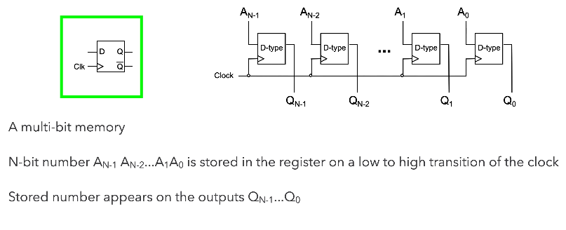

# Digital Logic

### Topic Outline

- Basic logic functions, expressions & truth tables
- Logic gates, circuits, & finding the truth table
- Simplifying logic expressions using Boolean algebra and karnaugh maps
- Common combinatorial, no memory, logic circuits
- Sequential, with memory logic circuits
- Three state logic
- Physical implementations

## Logic Gates, Circuits and Truth tables

### An Alternative view of the OR circuit

Why is $$\bar f = \bar A \cdot \bar B$$ an appropriate representation?

We know that $$\bar f = \overline {A+B}$$, this means $$f = A+B$$. Therefore, $$\bar f = \bar A \cdot \bar B$$ (de Morgan's Law)

### Electronic Logic Gates 

### Functions of Two Binary Variables

16 (24) functions can be found between two binary variables. We can interpret each of these functions algebraically.
$$
\begin{align}
f_0 &= 0 \\
f_1 &= A \cdot B \\
f_2 &= A \cdot \overline{B} \\
f_3 &= A \\
&\; \; \vdots \\
f_{13} &= \overline{A \cdot \overline{B}}
\end{align}
$$

### Combinatorial Logic Circuits

#### EX-OR Gates

#### NAND Gates

**NOT AND & OR,** are all the gates you need to make anything. Fundamental Gates

**NAND, NOR** are universal gates. Can be used to implement any function too. You either need the **NAND** or **NOR**, you don't need the other. 

## Simplifying Logical Expressions using Boolean Algebra

#### Logic Circuit to Truth Table

##### Simplifying logical expressions

Why? We do this to reduce complexity so we can reduce the number of gates required for their implementation. 

#### Circuit Equivalence

#### Truth table to Boolean Equation

####  Laws of Boolean Algebra

### Karnaugh Maps

Show unambiguously when a Boolean expression is in its simplest form.

#### Adjacency 

Adjacent squares differ by exactly one variable, to achieve "grey" coding.

#### Grouping

Make sure your groups must be a power of two!!

##### Example 1

 

How did we arrive at $f = \bar B + \bar A. \bar C$ ? 

Look at the orange group... ask yourself if each case changed; if it did, it cannot be part of the logical expression. If it stayed constant, e.g. B stayed constant at 0, hence in the logical expression of the orange group, it is $\bar B$.

##### Example 2

While you can choose either combination, sometimes it comes down to the number of **NOT** gates present. 

##### Example 3

This is one of the very few logical expression that you cannot simplify. 

##### Don't Care Conditions

## Combinatorial Logic Circuits

Perform as fast as your gates. 

Logic Circuits whose output is a logical function of their inputs. 

#### 1-bit Half-Adder

#### 1-bit Full-Adder

A Full-Adder is capable of - adding A and B, produce a Carry; add the Carry to A and B if needed; produce a Sum and an output Carry. 

### N-bit Full-Adder

### Adder to Adder/Subtractor

#### N-bit Adder/Subtractor

#### Decoders

This is an active low decoder, which means it is active when it is 0.  You are addressing unique locations -> most often used for addressing systems in the microprocessor system. 

#### Active High or Active Low?

From the Decoder section, you can see that we've mentioned "active low" this means the circuit is active when the transistor's output is 0. 

###### Why are circuits sometime active low? 

Transistor-Transistor Logic floats high - meaning that if you don't connect it to anything, it will assume it's a logical 1. Therefore, sometimes you have to enable it to be a active 0, so you don't accidentally enable certain circuits.

#### 

#### Active High Decoder

#### Encoder

####  Multiplexers (MUX)

#### De-Multiplexers (DE-MUX)

Homework: what are expressions for y1 y2 y3.

##### Common Applications of Multiplexers

Source selection control - Home stereo, e.g: send iPod, CD or radio to speakers - note that this is analogue not digital

Share one communication line between multiple senders - Requires both MUX and DE-MUX

Parallel to serial conversion - Parallel input on X, clock signal on S, serial output on Y

Circuit that can be configured to produce any truth table relationship between S inputs and Y outputs - Set up the truth table required on X inputs. 

##### Common Applications of De-Multiplexers

Share one communication line between multiple senders -Requires both MUX and DE-MUX

Series to parallel conversion

A control for multiple lights

- in a gambling machine you might connect a processor to A and S and connect Y outputs to lights, such that the processor runs in a rapid loop addressing each light sequentially.  

## Sequential Logic Circuits

A logic circuit whose **outputs** are logical functions of its **inputs** and its **current state.**

#### Flip-Flops

A basic building block of memory. Level triggered devices (a device that responds to 1s and 0s) that are stable in only two states.

#####  Flip-Flop Operation

#### D-Type Latch (Sequential x Combinatorial)

When we want to store data, we have that data at D, and we set enable to 1 (or trigger the "latch"). Only then will data be then go to Q.

##### D-type latch truth table

##### Clocked Flip-Flops 

Clocking and enabling are used fairly interchangeably but the right term is clock. All the "latches" above changes only on the rising edge of the clock input, they only respond to change. 

#### N-bit Register

A Dtype is a fundamental component, so know how to draw it and know these combinatorial circuit designs. A common clock hints to you that you're dealing with a register. 

When we provide a clock pulse, we are providing the transition from a 0 to a 1 and 1 to 0 probably afterwards. The D type will only respond to the 0 to 1, when that happens, each bit on every D type will go to each bit simultaneously and go to Q. 

No change will happen to Q unless we clock it again. This is how we can store data. 

This is what we call a parallel load register, because we load all the bits of A with one clock. 

An alternative design is...

#### N-bit Shift Register

Once you've understood all the parallel and shift register...

#### Three different kinds of triggers

###### Level triggered - 1s and 0s

###### Rising Edge triggered - transition from 0 to 1

###### Falling edge triggered - from 1 to 0 

## Three State Logic

**Why would we want to do this?** To make sure we can provide communications between logical subsystems. 

#### Three-state Buses

#### Multi-bit Bus

Buses are communication paths. The "dash 4" represents that there are 4 communication lines. 

## Physical implementations

#### Properties of Logic Gates

Remember that TTL logic floats high, so if you don't specify, it will be a logical 1. 

#### Propagation Delay

We're usually interested in the maximum propagation delay and we do this to make sure that our circuit doesn't cross the so-called "event horizon" where the change in the input is not registered by the output for a significantly long time because of propagation delay. 

You can think of propagation delay as the collective operating speed of the circuit.

#### Logic Integrated Circuits (IC)

##### PLA Example

Physical implementation of a sum-of-products.

###### PLA Organisation

###### PLA Function Implementation

This is actually an incomplete implementation of PLA. 