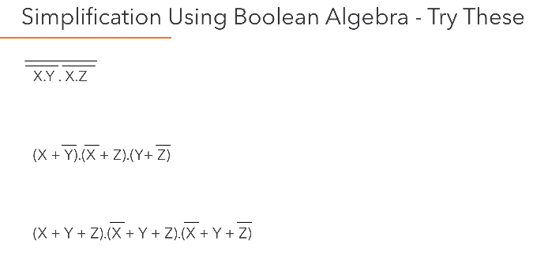
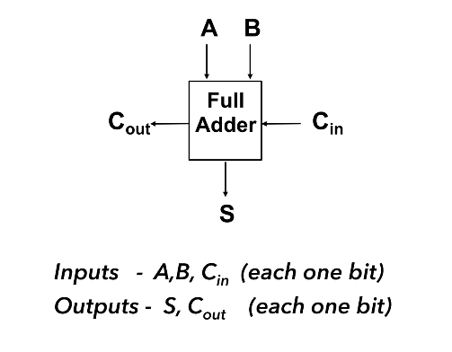
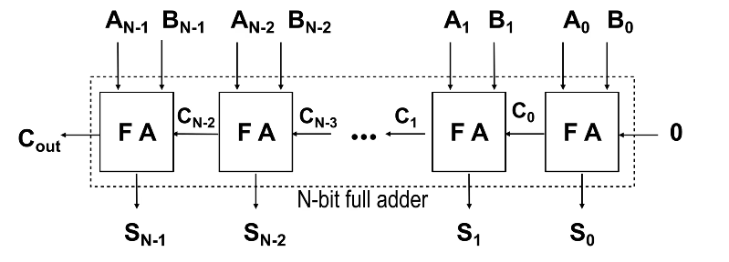
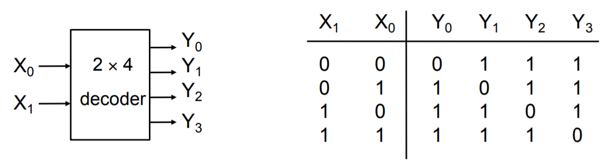

# Logic Gates, Circuits and Truth tables

## An Alternative view of the OR circuit

Why is $$\bar f = \bar A \cdot \bar B$$ an appropriate representation?

We know that $$\bar f = \overline {A+B}$$, this means $$f = A+B$$. Therefore, $$\bar f = \bar A \cdot \bar B$$ (de Morgan's Law)

## Functions of Two Binary Variables

16 (24) functions can be found between two binary variables. We can interpret each of these functions algebraically.

|  A   |  B   | $$f_0$$ | $$f_1$$ | $$\cdots$$ | $$f_{14}$$ | $$f_{15}$$ |
| :--: | :--: | :-----: | :-----: | :--------: | :--------: | :--------: |
|  0   |  0   |    0    |    0    | $$\cdots$$ |     1      |     1      |
|  0   |  1   |    0    |    0    | $$\cdots$$ |     1      |     1      |
|  1   |  0   |    0    |    0    | $$\cdots$$ |     1      |     1      |
|  1   |  1   |    0    |    1    | $$\cdots$$ |     0      |     1      |
{: .centeredtable}

$$
\begin{align}
f_0 &= 0 \\
f_1 &= A \cdot B \\
f_2 &= A \cdot \overline{B} \\
f_3 &= A \\
&\; \; \vdots \\
f_{13} &= \overline{A \cdot \overline{B}}
\end{align}
$$

## Electronic Logic Gates

There are 7 electronic logic gates whose function you should understand.

**AND, OR, NOT** are termed the **fundamental gates** because they can be used to build any of the functions that you see in the table above – meaning that they can also be used to build a circuit that fulfils the functions of the other gates you see below (**NAND, NOR etc.**).

Aside from the fundamental gates, the **NAND and NOR** gates which are termed the **universal gates** are important to understand as well because using either multiple **NAND** gates or multiple **NOR** gates we can build each **fundamental** gate. You either need **NAND** or **NOR**, you don't need the other. 

Additionally, while the **EX-OR** gate is not one of the fundamental or universal gates it is very useful as well.

# Simplifying Logical Expressions using Boolean Algebra

> The **motivation** for simplifying logical expressions is **economic**. When producing microprocessors, we usually want to optimise (minimise) the amount of materials we use to **reduce cost** – which mean to use a minimum amount of silicon and other resources. Therefore, as much as possible, we will want to reduce the number of logic gates that we require for a particular circuit.

This leads us to the idea of **circuit equivalence** where a *Boolean function can have many different but equivalent Boolean expressions*, and therefore different combinations of logic gates. What’s important is that given a function we are able to create equivalent circuits that:

1. **Perform the designated function**
2. **Use the types of gates available** (these are usually dependent on the physical implementation e.g. only want to use **NAND** gates or maybe we have some 4-input gates etc.)
3. **Minimise the number of gates used and hence cost**.

There are two crucial skills to have

## Logic Circuit to Truth Table

## Truth table to Boolean Equation

##  Laws of Boolean Algebra

In an exam, it is crucial that you **state** which rules you are applying so that what you are doing is **clear** to the marker.

|         Name         |                       AND                       |                 OR                  |
| :------------------: | :---------------------------------------------: | :---------------------------------: |
|   **Identity Law**   |                     1A = A                      |              0 + A = A              |
|     **Null Law**     |                     0A = 0                      |              1 + A = 1              |
|  **Idempotent Law**  |                     AA = A                      |              A + A = A              |
|   **Inverse Law**    |              $$A\overline{A} = 0$$              |      $$A + \overline{A} = 1 $$      |
| **Commutative Law**  |                     AB = BA                     |            A + B = B + A            |
| **Associative Law**  |               (AB)C = A(BC) = ABC               |      (A+B)+C = A+(B+C) = A+B+C      |
| **Distributive Law** |                A+BC = (A+B)(A+C)                |            A(B+C)=AB+AC             |
|  **Absorption Law**  |                    A(A+B)=A                     |               A+AB=A                |
| **De Morgan’s Law**  | $$\overline{AB} = \overline{A} + \overline{B}$$ | $$\overline{A+B} = \bar{A}\bar{B}$$ |
{:.centeredtable}

The best way to get good at this is to **practise.**

## Karnaugh Maps / Kmaps

> Using Boolean algebra, it can be difficult to tell whether an equation is in its simplest form or to see the next step to simplifying it. K-maps show unambiguously when a Boolean expression is in its simplest form.

**Grey Coding.** Because sum of products can be simplified by looking for terms that differ by only one variable and its complement, when we draw out a kmap we have to grey code – which mean each cell only differs by 1 variable from its neighbours (horizontally and vertically) as you can see below.

**Karnaugh Map Grouping.**  The **first step** to finding the simplest expression is to form kmap groupings. There are some things/rules/features to note about this.

1. **Wrap-around** is valid. This means the left most-column is adjacent to the right most-column, and the top row is adjacent to the bottom row. So the orange and green cells, and the blue and green cells are adjacent.
2. **Groupings can overlap**. The cells don’t have to exclusively be in just 1 group.
3. The minimum logic expression is obtained on **minimum number of groupings**.
4. Number of elements in the group **must be a power of two** 1,2,4,8 etc..

The **second and last step** is to look within a particular group and *omit* the **case/variable** that *changes* from the **group’s** logic expression and *include* those that stayed *constant*. This is because those that change are not **definitional** to the group’s logical expression. 

The **values** of the cases/variables that stayed constant depend on the value within the grouping. In the example below **B** changes within the blue group so it is omitted, and both **A and C** stayed constant with value **0** so the final logic expression for the blue group is $$\overline{A} \cdot \overline{C}$$. 

### Multiple equivalent expressions

In the exams, there will be no penalty if you give either answer but note that in reality sometimes the final choice comes down to the resources you have available like the number of **NOT** gates that you can use.

Additionally, there are some expressions that are **impossible to simplify**. This example is just one of the very few logical expression that you cannot simplify because you cannot get any groupings more than 1.

### Don't Care Conditions

Sometimes a certain combination of inputs either can’t happen or we don’t care what the output is if it happens. We denote this with a ❌ in our kmaps which may be assumed to be either 1 or 0 — we don’t care. 

These can allow us to create a simpler logic expression. If you take a look at the left kmap, you can see that there’s an outstanding 1 just below the ❌, and there are multiple ways we can choose to group it. If we do it like in the right kmap, you can see that we arrive at a slightly simpler logic expression – and the only reason we can group it that way is because the 01-00 cell is a **don’t care condition**.

# Combinatorial Logic Circuits

> A logic circuit whose output is a **logical function** of its input(s).

Perform as fast as your gates. 

## 1-bit Half-Adder

This circuit performs the addition of two bits, and can be extended to form a 1-bit full-adder. What’s important is that you recognise that the truth table for **sum** represents that of an **EX-OR** gate, while the **carry** represents that of an **AND** gate.

This important because to derive the layout of the circuit, you can start from thinking about what you want to achieve first, i.e the addition of two bits. The truth table essentially describes this function and from there you can think about which gates you have to use and how they should be arranged according to the 1s and 0s in the truth table.

## 1-bit Full-Adder

A 1-bit full adder is capable of adding two bits (A and B) and considering a carryin from another 1-bit full adder, to produce an output sum and a carryout.

	
	

To design a circuit of a 1-bit full adder it is helpful to think about the logic gates needed based on the truth table above. Pay attention to how the value of **Cout** and **S** relate to **Cin, A, and B** and try to think of the logic gates needed to emulate this behaviour/function. 

It is highly suggested that you try this on your own before clicking to see my own attempt – and also take mine with a pinch of salt and tell me if you think I’m wrong or can be better! 

    
My design of a 1-bit Full-Adder

    

    Looking at the truth table shown earlier, I realised that $$Sum = (A \oplus B) \oplus C_{in} \\ C_{out} = A \cdot B + C_{in} \cdot (A \oplus B)$$
    With these two logic expressions, I was able to decide which logic gates to
    use to arrive at my final design for the full adder.
    

	

## N-bit Full-Adder

Once we know how to design a 1-bit Full Adder (FA) we will be able to build a n-bit full adder which we can use to add 2 n-bit words (A and B) together. We do this by assigning each bit of A and B to each FA, and just like how we do long division we add each bit together, starting from the LSB (where the carry in is obviously 0) and then taking the carry of each FA and feeding it to the next FA until you reach the nth FA. 

The output of each sum (Sk) and the final Cout is then “dealt with” to arrive at the sum of A and B. It is important to consider how you would “deal” with all these bits, and also important to note that if Cout is 1 then it means you have an **overflow**.

## Adder to Adder/Subtractor

### N-bit Adder/Subtractor

You can see that **Z** is fed as the Cin of the first FA, this has the effect of adding 1 to arrive at the proper value for the two’s complement **B**. From above, **Z** is **EX-ORed** with each bit of **B** and this has the effect of inverting the bits to get **-B**. When we are adding, then **Z** will be 0 and will have no effect on **B**.

Remember that when we are adding, the final Cout must be the MSB of the sum of **A** and **B**, but if we are subtracting, Cout should be ignored. 

## Active High or Active Low?

> Transistor-transistor logic floats high – meaning that if you don’t connect it to anything, its value is a logical 1. Hence, it is helpful for **0** to be the **active** state so that you are not accidentally enabling circuits.

In some circuit applications, outputs and inputs have **active** and **inactive** states (you’ll see more of this in Three State Logic) and it is important that your input(s) and output(s) conform to the same standard. 

- **Active high.** 0 is inactive and 1 is active.
- **Active low.** 0 is active and 1 is inactive. This is sometimes indicated with Enable – so if you see this bar it means that particular input/output is active low. 

## Decoders

A decoder has **k** input pins and **2k** output pins. This is because with **k** inputs can have **2k** possible states/combinations and can represent the same number of output values.

> Decoders are often used to address unique memory locations in a microprocessor system.

Here we have an example of a truth table for an **active low** decoder on the left. Notice that the distinct value of each Yi is 0, which makes sense that because we only want 1 possible output to be **active** for a particular **input state**. The truth table for an **active high** decoder is on the right (notice how the Yi bits are all flipped compared to **active low**). 

    
    

## Encoder

The opposite of a decoder, where you take multiple input values and you **define** it in a more **concise representation**. Here you have 2k input(s) and k outputs. However, unlike the decoder where the inputs take all possible states, only one of the input pins should be **active at a time**. 

> Encoders usually used in communication because it is more **efficient** and succinct to send a **compressed representation** of certain values. Often used as simple input circuits.

##  Multiplexers (MUX)

A very common mechanism for selection.

> **Common Applications of Multiplexers.**
>
> Source selection control - Home stereo, e.g: send iPod, CD or radio to speakers - note that this is analogue not digital
>
> Share one communication line between multiple senders - Requires both MUX and DE-MUX
>
> Parallel to serial conversion - Parallel input on X, clock signal on S, serial output on Y
>
> Circuit that can be configured to produce any truth table relationship between S inputs and Y outputs - Set up the truth table required on X inputs.

## De-Multiplexers (DE-MUX)

> **Common Applications of De-Multiplexers.**
>
> Share one communication line between multiple senders – Requires both MUX and DE-MUX
>
> Series to parallel conversion
>
> A control for multiple lights – In a gambling machine you might connect a processor to A and S and connect Y outputs to lights, such that the processor runs in a rapid loop addressing each light sequentially.  
>

# Sequential Logic Circuits

>A logic circuit whose **outputs** are logical functions of its **input(s)** and its **current state.**

## Flip-Flops

A basic building block of memory. Level triggered devices (a device that responds to 1s and 0s) that are stable in only two states (**Q and P** are always opposite). I think the best way to understand the flip flop is to look at the truth table and the timing diagram together.

    
    

    

Firstly, notice that **Q** and **P** are always different values. Next, see how **Q** only changes from 1 to 0 when **R** changes from 1 to 0? I think it’s better to think of this as Q is activated when **R** is activated (remember this is active low). 

Then also notice how when **R** is made inactive, the value of **Q** is still 0 (activated) – hence, the flip-flop is able to **store** a value when both **S** and **R** are inactive. Next when **S** is now activated, **Q** is **set** from 0 to 1 and **P** changes from 1 to 0. Again, when **S** is deactivated, the value of **P** and **Q** don’t change. Only if **R** is activated again, do the values of **P** and **Q** flip.

Now that you have understood that, you can look at the circuit diagram and see how and why having both **S** and **R** set to 0 doesn’t quite make sense and is a **hazard condition**.

## D-Type Latch

This is more important to understand than flip-flop. The first two NAND gates and the NOT gate ensure that the intermediate values just before the orange section can never be both be 0. (I’ll make a diagram soon).

When we want to store data, we have that data at D, and we set enable to 1 (or trigger the "latch"). Only then will the data from D go to Q. Otherwise, you can see that 

##### D-type latch truth table

##### Clocked Flip-Flops 

Clocking and enabling are used fairly interchangeably but the right term is clock. All the "latches" above changes only on the rising edge of the clock input, they only respond to change. 

#### N-bit Register

A Dtype is a fundamental component, so know how to draw it and know these combinatorial circuit designs. A common clock hints to you that you're dealing with a register. 

When we provide a clock pulse, we are providing the transition from a 0 to a 1 and 1 to 0 probably afterwards. The D type will only respond to the 0 to 1, when that happens, each bit on every D type will go to each bit simultaneously and go to Q. 

No change will happen to Q unless we clock it again. This is how we can store data. 

This is what we call a parallel load register, because we load all the bits of A with one clock. 

An alternative design is...

#### N-bit Shift Register

Once you've understood all the parallel and shift register...

## N-bit Counter

You need to know how to explain this. Always label all the input and outputs of the D-type latch so Q bar and all. 

#### Three different kinds of triggers

###### Level triggered - 1s and 0s

###### Rising Edge triggered - transition from 0 to 1

###### Falling edge triggered - from 1 to 0 

# Three State Logic

**Why would we want to do this?** To make sure we can provide communications between logical subsystems in an efficient way (by sharing buses). 

#### Three-state Buses

#### Multi-bit Bus

Buses are communication paths. The "dash 4" represents that there are 4 communication lines. 

## Physical Implementations

#### Properties of Logic Gates

Remember that TTL logic floats high, so if you don't specify, it will be a logical 1. 

#### Propagation Delay

We're usually interested in the maximum propagation delay and we do this to make sure that our circuit doesn't cross the so-called "event horizon" where the change in the input is not registered by the output for a significantly long time because of propagation delay. 

You can think of propagation delay as the collective operating speed of the circuit.

#### Logic Integrated Circuits (IC)

##### PLA Example

Physical implementation of a sum-of-products.

###### PLA Organisation

###### PLA Function Implementation

This is actually an incomplete implementation of PLA. 