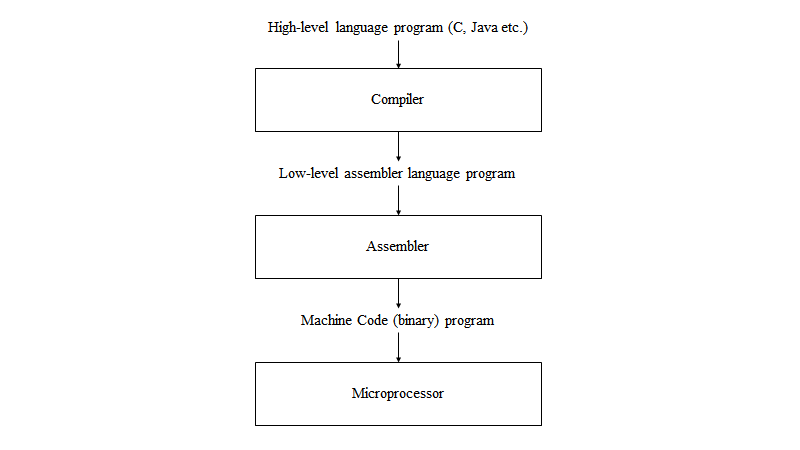

# Microprocessor Fundamentals

Before diving into assembler, we need to be familiar with the **key components of all CPUs**. No matter how complex a CPU is, they always have the two following components.

- **Arithmetic Logic Unit** (ALU): this performs **math and logic**
- **Control Unit** (CU): this decodes program **instructions** and handles **logistics** for execution

> The CPU will constantly perform the following instruction cycle (the **fetch-decode-execute cycle**):
> - Retrieve instructions from memory
> - Decode to form recognisable operations
> - Execute to impact the current state

❕❗ **Learn the fetch-decode-execute cycle**. Think of it every time you look at a CPU, or a series of instructions. Think about which of the components (the CU or the ALU) are operating and when.

The instruction cycle takes place over **several CPU clock cycles** – the same clock cycles we saw in **sequential logic circuits**. The FDE cycle relies on several CPU components interacting with one another.

## FDE Components
There are several components that make up the FDE cycle:
- ALU
- CU
- **Program Counter** (PC): this tracks the **memory address** of the **next instruction** for execution
- **Instruction Register** (IR): contains the **most recent instruction** fetched
- **Memory Address Register** (MAR): contains the address of the _region_ of memory for read/write purposes
- **Memory Data Register** (MDR): contains **fetched data** from memory or **data ready to be written** to memory. The MDR is also sometimes referred to as the Memory Buffer Register (MBR).

> Remember that the **Control Unit** is connected to all components

A typical instruction cycle may look something like this:

| Fetch                                                        | Decode                                                       | Execute                                                      |
| ------------------------------------------------------------ | ------------------------------------------------------------ | ------------------------------------------------------------ |
| 1. Instruction Received from memory location in PC<br />2. Retrieved instruction stored in IR<br />3. PC incremented to point to next instruction in memory | 1. Opcode retrieved / instruction decoded<br />2. Read effective address to establish opcode type | 1. CU signals functional CPU components<br />2. Can result in changes to data registers, such as the PC etc.<br />3. PC incremented to point to next instruction in memory |

# Registers

Now that we have the FDE cycle established, we need **registers** to help store intermediate information- this can either be in the form of memory or system flags. The Motorola 68008 will be used to give context to each type of register:

> You can think of a register as a parallel set of bits which can be toggled on or off.

## Data registers
- These are useful for storing **frequently used values** or **intermediate results** of calculations.
- You typically **only need one** data register **on chip** – however, the advantage of having many registers is that **fewer references to external memory are needed**.

> The 68008 has 32 bit data registers. This is a _long_ register; 16 bits form a _word_, and 8 bits form a _byte_.

## Status registers
- These have various status bits that are set or reset by the **ALU**.
- They are a _set of flags_:
  -  Half are for the **system** (CU)
  -  The **conditional control register** is a **subset of flags**

| ⬅ System byte ➡ |                 ⬅ User byte ➡                 |
| :-------------: | :-------------------------------------------: |
|     8 bits      | 8 bits, where a few bits will make up the CCR |

> The CCR is made up of several bits representing statuses such as _extend, negative, zero, overflow, carry_. If you wanted to check the status of the computer in a program, you could use bitwise **AND** against a bitmask (the string of bits you want toggled) and seeing if the final result is the flag you wanted to see.

## Address register
- These are used as **pointer registers** in the calculation of operand addresses.
- Operations on these addresses **do not alter the CCR**.
- Only the **ALU** has the capacity to incur changes in status (through operations on non-addresses).

### Stack pointer
- This is an **address register** that points to the **next free location**; it can hold **subroutine return addresses**.

> The 68008 has pointer registers `A0-A6` whilst `A7` is used as a system stack pointer.

## Program counter
We are already familiar with what the PC does – it is a **32 bit** register on the 68008 that keeps track of the address at which the next instruction will be found. 

> If you were writing a software emulator, think of the memory as an array of strings (each string is an opcode). The PC would be an integer; your code would access `memory[PC]` to find out which opcode to pull from the memory and decode. Therefore, by incrementing the PC (an 8-bit, 16-bit, or 32-bit integer in your code) you can increment through the memory array. You can sometimes increment the PC by multiple amounts.
> Generally speaking, if you were to be writing an emulator for any CPU, you _could_ represent each register as an n-bit unsigned integer as you can toggle bits and perform bitwise operations, including bitshifts, on each integer variable. You would typically want to implement memory as a simple array of m-bit integers, where m is the word length of your CPU.

# Register Transfer Language

> RTL is used to describe the operations of the microprocessor as it is executing program instructions.
> It is also a way of making sure we access the correct parts of the microprocessor – **do not confuse it with assembler instructions**.

| Example RTL | Meaning |
|-------------|---------|
| `[MAR] ⬅ [PC]` | _Transfer_ the contents of the PC **to** the MAR |
| `[MS(12345)]` | The _contents_ of memory _location_ 12345 in the _main store_ |

### Example: Instruction fetching
Given a series of instructions in words, we can find a way to represent this in RTL. Consider the following example:

| Plain words | RTL equivalent |
|-------------|----------------|
| Contents of PC transferred to MAR address buffers | `[MAR] ⬅ [PC]` |
| Increment the PC | `[PC] ⬅ [PC] + 1` |
| Load MBR from external memory, and set $$R / \bar W$$ to Read | `[MBR] ⬅ [MS([MAR])]`; $$R / \bar W$$ to Read |
| Transfer opcode to IR from MBR | `[IR] ⬅ [MBR]` |
| Decode the instruction | `CU ⬅ [IR(opcode)]` |

If you wanted to add a constant byte to a register (take `D0` from the 68008), you would engage the ALU and then transfer this into a register:
```
{ continue previous cycle }
[MBR] ⬅ [MS([MAR])]
ALU ⬅ [MBR] + D0
[DO] ⬅ ALU
```
As you can see, RTL describes how we can specifically set values in registers and interact with components in a standardised language.

# Assembly Language

You should be able to explain the motivations, applications, and characteristics of high-level and low-level programming languages.

|                     High-level Language                      |                           Assembly                           |                Machine Code                |
| :----------------------------------------------------------: | :----------------------------------------------------------: | :----------------------------------------: |
| Human readable. Difficult to translate into performant machine code whilst retaining original intention. | Middle-ground. More readable than machine code but more precise than high-level languages. | Very precise and performant. Not readable. |



> Assembly language saves us from machine code by using **mnemonics**.
> We can provide **memory locations** and **constants**, as well as **symbolic names**.
> These features are not afforded to us by RTL!

Assembly language typically takes the following form:

|  | Label | Opcode | Operand | Comment |
|:-----:|:------:|:-------:|:-------:|:-------:|
| **Example** | `START:` | `move.b` | `#5, D0` | `|load D0 with 5` |

### Assembly Language Conventions

There are several conventions of Assembly language to keep in mind:

| Number Symbol | Meaning |
|---------|-------------|
| `#` | A constant value, in base 10. **This is not an address.** |
| `$` | A **hex** value |
| `%` | A **binary** value |

<br/>

| Directives | Definition | Convention | Example |
|------------|------------|------------|---------|
| Label names | You can assign labels to represent bytes or instructions | Label or name followed by `:` | `ANS: DS.B 1` will leave 1 byte of memory empty and name it ANS |
| Defining storage (`DS`) | Instruct the assembler to reserve some memory | `DS.{data type} {amount}` | `DS.B 1` will leave 1 byte of memory free. See data types further on. |
| Origin (`ORG`) | Tells the assembler where in memory to start putting the instructions or data | `ORG` followed by value | `ORG $4B0` starts the program at hex `4B0` |

If you want to string together an assembler instruction, you typically write them in the form
`operation.datatype`  `source,`   `destination`

### Data types and assembler instructions

Previously, we saw how the `DS` directive requires a data type and then an amount of data to set aside; Assembler language defines three types of data type:
- **8 bits / byte**: `.b`
- **2 bytes / word**: `.w`
- **4 bytes / long word**: `.l`

> You can typically omit the data type and `.` if you are working with a **word**.

# Instruction set aspects

Generally speaking, there are two aspects to a CPU instruction set:
- **Instructions** which tell the processor which operations to perform
  - Data movement: this is similar to what we have already seen with RTL
  - Arithmetic instructions: keep in mind whether your CPU can operate on fractional numbers
  - Logical instructions
  - Branch instructions
  - System control instructions
- **Addressing modes** tell the processor which ways it can access data or memory locations, or how they may be calculated by the CPU.

> Addressing modes can provide data, specify where it is, and how to go find it.
> You may describe direct addresses, or relative addresses where you compare one address to another to find it.

#### Logical instructions
- We can often use **bitmasks** to achieve our goals in conjunction with **bitwise operations**.
- **Shift operations** are fundamental; for example, you can multiply by 2 using left shift operations.
- Other operations such as rotations also exist.

#### Branch instructions
These are crucial for **control flow statements**; we typically branch based on **conditions set in the CCR**.

#### Subroutines
Subroutines (`JSR`; jump, `RTS`; return)  let you use the **same code repeatedly**. You will **push and pop the stack** to return to the PC.

# Addressing modes
As mentioned earlier, there are several ways for the CPU to access memory; you should be familiar with the following, and they are found on many CPUs (not just the 68008):

| Address type | Definition | Example |
|--------------|------------|---------|
| Direct address | Explicitly specifying two registers in the same command | `move D3, D2` |
| Immediate address | The **operand** forms part of the instruction and **remains constant** | `move.b #$42, D5` |
| Absolute address | This **specifies the destination location explicitly** | `move.l D2, $7FFF0` which moves the long value held in D2 to address `$7FFF0` |
| Relative address | These all **relate to the program counter** to write **position independent code** | |

> Indirect addressing is never on the exam; however, this is where we add offsets, increments, or indexed addressing to access memory or data.