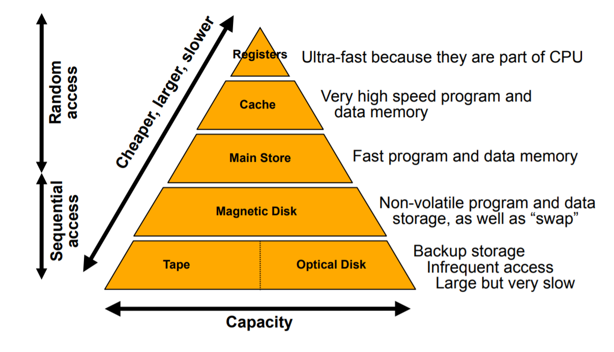

# Memory Hierarchy

- Cache can be on or off chip - we usually have more cache than registers but less cache than RAM (Main store)
- RAM is still fast memory - where we retrieve our data and instructions from
- We do this so we can achieve performance at a reasonable cost and give ourselves the capacity we need
- This hierarchy presumes we can move the data in between the hierarchy
  - In particular the goal of caching algorithms - is to again achieve good cost per bit, good performance
  - If the cpu requests some data - we want that data to be found in registers if not cache if not Main store (worst case). 

> The memory hierarchy is motivated by **economics!** 
>
> Small sequential loops, subroutines, operations on data structures like arrays mean that the locations in memory which will be accessed are “predictable”.