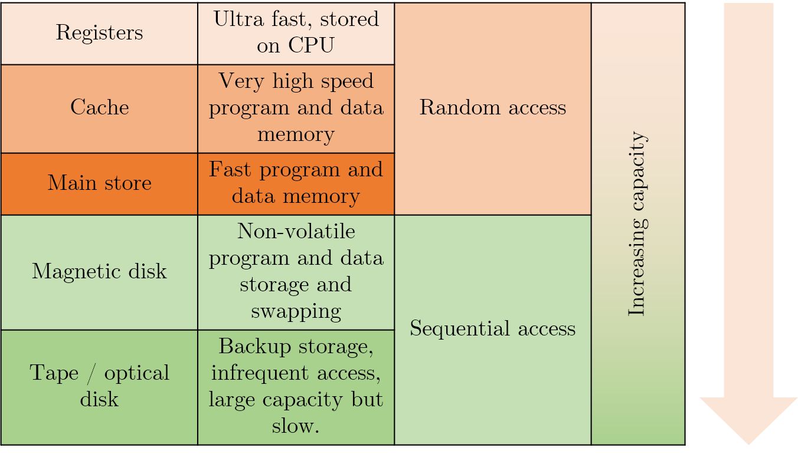
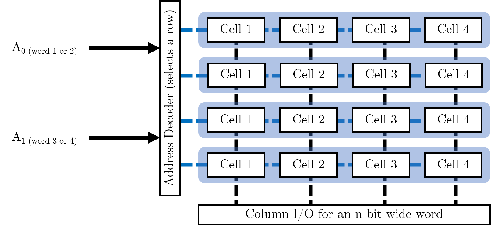

# Memory Systems
## Memory hierarchy
When deciding on a memory technology, you must consider the following factors:
- Frequency of access
- Access time
- Capacity required
- Financial cost

> The **designer's dilemma** is the conflict that is caused by choosing between low cost, high capacity storage or high cost, low capacity storage.
> Ideally, we would want our storage access to be frequent, quick, and spatially efficient- the balance of these three leads to the cost of the storage.

We know that roughly **90%** of memory accesses are within +-2KB of the previous program counter position. Therefore, we should only choose expensive memory **when we need it**, which is due to **spatial locality**.

**Temporal locality** refers to the likelihood that a particular memory location will be referenced in the future.

## Cache Memory
- Cache is **kept small to limit cost**; it is also **transparent to the programmer**. However, this does allow _some_ control over what is stored in it.
- A cache access is known as a **'cache hit'**.
- Cache speed is incredibly important- moving down the memory hierarchy will take orders of magnitude more time for similar memory hits.

> **Moore's Law** is focused on the transistor count within integrated circuits. It states that this count doubles roughly every two years.
> Currently, single core frewuency is tailing off; this has lead the industry to focus on multicore performance instead.
> Comparitively, memory access speed is improving much more slowly; access time and capacity can become a huge bottleneck when it comes to creating performant systems.

> Cache concepts are not included in these notes as they are not fully examined, and also do not feature in the revision videos.

## Memory Cell Organisation
Now that we're familiar with different parts of the memory hierarchy, it's crucial that we understand how this memory is actually constructed (down to the metal almost). 

### Semiconductor Memory (main store)
Semiconductor memory is the most common form of main store memory, otherwise known as **RAM**. It can be broken up into several groups:
- **Static RAM** (SRAM)
  - SRAM uses a **flip-flop** as storage element for each bit.
- **Dynamic RAM** (DRAM)
  - For each bit, the **presence or absence of charge** in a capacitor to determine a `1` or `0`.
  - The capacitor charge **leaks away over time**, which requires **periodic refreshing**.
  - DRAM is typically cheaper than SRAM which is why we accommodate for the higher overhead.
> Refreshing DRAM incurs a **constant overhead**, which means that it **does not increase per bit**.

Both **SRAM and DRAM are volatile** memory storage- therefore, power must continuously be applied. However, the similarities end there and it is crucial to recognise the differences between the two memory cells.

> Always ask yourself about the cost of these memory technologies- it is the reason we have decided to use semiconductor memory as our main store.

| SRAM cells | DRAM cells |
|------------|------------|
| Provides **better read/write times** | Generally simpler and more compact, which allows for **greater memory cell density** |
| **Cache memory**, both on and off chip, is implemented as SRAM | Cheaper to produce than equivalent SRAM memory, and hence is used for **main memory** |

DRAM can be organised even further:
- Synchronous DRAM (SDRAM)
- Rambus DRAM (RDRAM)
- Double Data Rate Synchronous (DDR SDRAM)
- Cache DRAM (CDRAM)

## Organising memory 

### Memory cells
Before we begin organising memory, it's useful to know what the individual memory cells will look like. Think of them as single boxes with the following properties:
- They only store two states (`1` or `0`).
- They are capable of being written to as well as read from. This is controlled by a $$R / \bar{W}$$ line which determines which direction the information will flow from.
- They are enabled when a single pin, such as a `SELECT` line, is powered.

> You can think of a memory cell as a means of storing a single bit.

### Storing single words

In order to store multiple bits together (i.e. words), we will simply store a series of memory cells next to each other. We will need some column selecting I/O to handle selecting the individual bits of the word correctly.

### Storing multiple words

Now that we have organised individual words, we want to store multiple words in memory. We can use this grid arrangement to arrange the words in parallel as follows (imagine we wanted to store four of the 4-bit words shown above):

In our **address decoder**, we have $$ log_{2} (W) $$ many control pins, where $$ W $$ is the number of words we want to store in memory. (This is because each pin can be high or low, and hence refer to two distinct words). 

**We want to maintain a square grid of cells.** We could simply have a 16-bit word, which we partition into four individual words (it is possible to put smaller words into the registers of larger ones). However, this would require 16 data lines on the column selection IO, with each bit requiring power; this would be rather lopsided and would result in a column selector doing all the work. Maintaining a square grid means that we can balance the number of required pins across two different pieces of IO, each with their own power requirements.

> We are trying to avoid long, narrow arrays when we design our memory cell arrays. We want to **maximise space for memory cells** and minimise space taken up by IO.

# Detecting and Correcting Errors

> Although this topic is within the memory systems lecture, it is fundamental to error detection on the whole and hence has its own section here.

Broadly speaking, there are two types of errors:
- Errors that occur **within a system**, e.g. in a memory system.
- Errors that occur in the **communication between systems**, e.g., in the transmission of messages or data between systems. This is what we will focus on.

## Noise

- We typically **send information through channels**- when these channels become affected by **unwanted information**, they become **noisy**.
- Noise will arise from the **physical properties** of devices:
  - Thermal noise
  - Noise of electronic components
  - Noise of transmission circuits
- **Magnetic media** will also have a "classic form of noise" due to the "random alignment of magnetic fields".

> Noise is **always present**. If it doesn't come from the components themselves, it'll come from external sources such as radiation. Noise is hence one of the **limiting factors** in computer systems.
> In magnetic stores, when we have **decreased area** to store a bit, **noise gets worse** which increases the likelihood of errors.

### Digital logic devices

> We choose binary systems for our number systems as it provides us a **high degree of noise immunity**.
> We also need to consider the **tolerances of the components we use**

#### Illustrating noise immunity, a trademarked Akram Analogy™

_If you are comfortable with the idea of noise immunity and transistor-transistor logic voltage levels, you probably won't need to read this._

To illustrate the first point, consider the following thought experiment:
- You and your friend have found a massive tunnel (assuming CS students step outdoors). **The tunnel has water dripping and some other ambiguous sounds.**
- You both stand at either end of the tunnel, and you realise now you want to say something to your friend. You have two choices:
  - You can choose to simply clap your hands to get their attention (a binary communication system), OR
  - You can choose to say a magic password that only they will respond to (a base-26 communication system).

Given the ambiguous sounds in the tunnel, which do you think your friend will be able to distinguish better? Would they be able to distinguish a clap above a specific volume? Or would they be able to distinguish the spoken magic password? How do you know when a sound is finally loud enough to constitute you communicating with one another?

This idea of a small window where we do not consider a signal high or low is widest when we use a binary system- if we had any more possible values, we would need to find even more ranges which we consider 'nothing' (_**i.e. neither 0 nor anything else)**_. 

> Using binary means that we only focus on two logical values.

In the image below, you can see the illustrated example for the above analogy, with annotated TTL voltage levels for context.

There is a point at which **if there is too much noise**, i.e. a train suddenly passes through the tunnel, your clap will never be heard and is permanently lost- this is known as a **loss/ collapse of immunity**.

## Detecting single errors
If we _assume_ that errors occur **at random** due to noise, one could naively ask you to clap three times and hope that your friend hears majority of them- i.e., you could send the message several times and take a vote. However, this is a very expensive affair (you would get tired quickly).

We can make the further assumption that **if the probability of one error is low, the probability of two errors close together is even lower**. Using this knowledge, we can add a **parity bit** to the message which can **summarise the property of the message**. We can check that this property is intact to see whether the message has been altered; using a parity bit is typically **cheaper and adequate** in many situations.

### Parity systems

> There are many different types of parity systems, but the two main ones you should be focused on are the **even parity** and the **odd parity** system.
> Each system will add an extra bit to the message which makes the **number of logical 1's even or odd** depending on the system chosen.

| Non-parity message (7 bits) | Even parity bit added | Odd parity bit added |
|-----------------------------|-----------------------|----------------------|
| `100 0001` | `0100 0001` (two `1`'s) | `1100 0001` (three `1`s) |

It is possible to calculate the parity bit using hardware or software.

#### Finite automaton to calculate parity

The lecture slides contain a two-state finite automaton- this diagram shows how, for a message `110` travelling on an **even parity system**, we can use the automaton to reach a parity bit of `0`, so the message to be sent is `0110`.

#### Hardware to calculate parity

You can calculate the parity bit for a message by **XORing each bit with one another**. You can achieve this by connecting each pair of bits to an XOR gate; for an odd number of input bits, add a `0` for an **even** parity system and a `1` for an **odd** parity system.

## Detecting multiple errors

> In the real world, it is more likely that **errors will appear in bursts**.

Burst errors can be caused by number of reasons, including but not limited to network or communication dropouts for a few milliseconds.
In this scenario, there may be errors in multiple bits and single-bit parity will still hold. Therefore, we must move to **checksums** to check entire columns.

### Bit-column parity
One way in which we can identify errors in multiple columns (i.e. multiple bits) is to use bit-column parity. 

Take the message, `Message`, which is made up of 7 7-bit ASCII characters:

| Character | 7 Bits |
|-----------|--------|
| `M` | `100 1101` |
| `e` | `110 0101` |
| `s` | `111 0011` |
| `s` | `111 0011` |
| `a` | `111 0001` |
| `g` | `111 0111` |
| `e` | `111 0101` |

 
By arranging each column into its own message, we can then calculate a parity bit for each message:

| Column number | 7-bit column | Even parity bit |
|---------------|--------------|-----------------|
| 1 | `111 1111` | `1` |
| 2 | `011 1111` | `0` |
| 3 | `001 1000` | `0` |
| 4 | `100 0000` | `1` |
| 5 | `110 0011` | `0` |
| 6 | `001 1010` | `1` |
| 7 | `111 1111` | `1` |

We can then take _this_ column and turn it into a 7-bit message: `1001011` spells out ASCII `K`. Now, we can add `K` to the end of our original message, and send the final message `MessageK`.

> This system will detect all burst errors of less than 14 bits; it will fail if an even number of errors occur in a bit-column (i.e., a message equal to 8 characters).

### Error Correcting Codes: row and column parity

The above example only detects errors in columns- but it doesn't stop us from using row correction at the exact same time. If we have both row parity and column parity, then we begin by checking if each column has correct parity. If we find a column with incorrect parity, we immediately begin going through the rows, and checking the parity of each row. If we find a mistake in a row as well, we simply need to invert the bit found in the column with an error. This ECC enables us to detect multiple errors and fix single errors.
