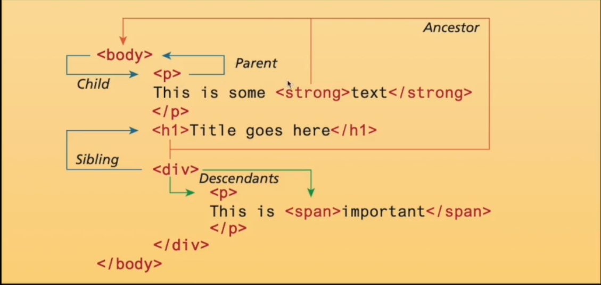

This document is split into two parts theory and practical

# Theory

## Introduction
Stands for HyperText Markup Language

HTML is a __semantic__ language it describes the structure of the document and not the content

## HTML Nesting structure
### parent 
A tag is a parent of another if it is immediately encloses the inner tag
### child
A tag is a child of another if it is immediately inside the tag
### ancestor
A tag is an ancestor if it the parent or the parent of an ancestor of a tag
### ancestor
A tag is an descendant if it the child or the child of an descendant of a tag
### Sibling
Two tags are siblings if they share a parent

# Practical
While not always strictly necessary and browsers may show pages without these virtually every good page contains the required tags specified by (R)

## Syntax
HTML uses code tags for opening and closing to give information about the content inside
opening use `<>` and closing starts with a backslash `</>`

the tags can also contain attributes additional information likes to other pages or ids

Desc| Code
----|-------
Opening tag | `<a href="www.google.com">`
element Name| `<a`
Attribute   | `href="www.google.com"`
content     | `a search engine`
closing tag | `</a>`

combined:
`<a href="www.google.com"> a search engine </a>`

### empty tags

Some tags have no content and so are empty, a closing tag is not needed
`<meta charset="utf-8">`

## HTML Nesting
all closing tags should occur int he reverse order they were opened e.g

`<h1> Chare your <strong> Travels </strong><h1>`

is correct

`<h1> Chare your <strong> Travels <h1></strong>`

is incorrect

## Character Entities
some symbols have special characters

Entity | Description
---|---
`&nbsp;` | non breakable space
`&lt;`|&lt;
`&gt;`|&gt;
`&copy;`| &copy;
`&trade;`| &trade;

## validation
for validation visit 
[W3c](https://validator.w3.org/)
# Tags

## Doctypes (R)
Every HTML document has a doctype definition 
Variations of HTML, tells the browser what to expect

`<!DOCTYPE html>`

## HTML (R)
Specifies content as html

`<html> Content </html>`

## head (R)
typically contains information about the page title etc

`<head>  </head>`

## title
Title of the page shown in the browser tab 

`<title> Title of the page </title>`

## meta / text encoding
character encoding can be declared using the meta tag

`<meta charset="utf-8">`

## body (R)
contains the main page of information

`<body> content </body>`

## Headings 
uses h1 through h6 in decreasing size

* `<h1>Welcome to cs136</h1>`
* `<h2>Welcome to cs136</h2>`
* .....
* `<h6>Welcome to cs136</h6>`

## a (Links)
produces a link that whn clicking on the content redirects to another page
uses attribute href to specify page

`<a href="www.google.com"> a search engine </a>`

href can link to external sites but can also link to within the page e.g `href="#top"` will move the page to a tag with id top

## img (Image)
Displays an image on the page

uses attribute src to specify location

alt attribute is a description for software to interpret the image

``

## Strong
makes any content bold

`<strong> content </strong>`

## p
specifies a paragraph of text

`
 paragraph 
`

## div 
defines site structure

`
 content 
`

## abbr
used to define an abbreviation 

`<abbr title="World Health Organization">WHO</abbr> was founded in 1948`

## br break
a break similar to newline no content

` `

## code 
give content a code like look

`<code> this is code </code>`

## em emphasis
provides emphasis usually italics

`<em> no </em>`

## mark
highlights the content

`<mark> highlight </mark>`

## small
makes text small

`<small> small text </small>`

## span 
used to specify text for specific font and color changes

`the sky is blue`

## Lists

* ordered list `<ol>`
    * List item `<li>`
* Unordered list `<ul>`
    * List item `<li>`
* descriptive list `<dl>`
    * list terms `<dt>`
    * List descriptions `<dd>`