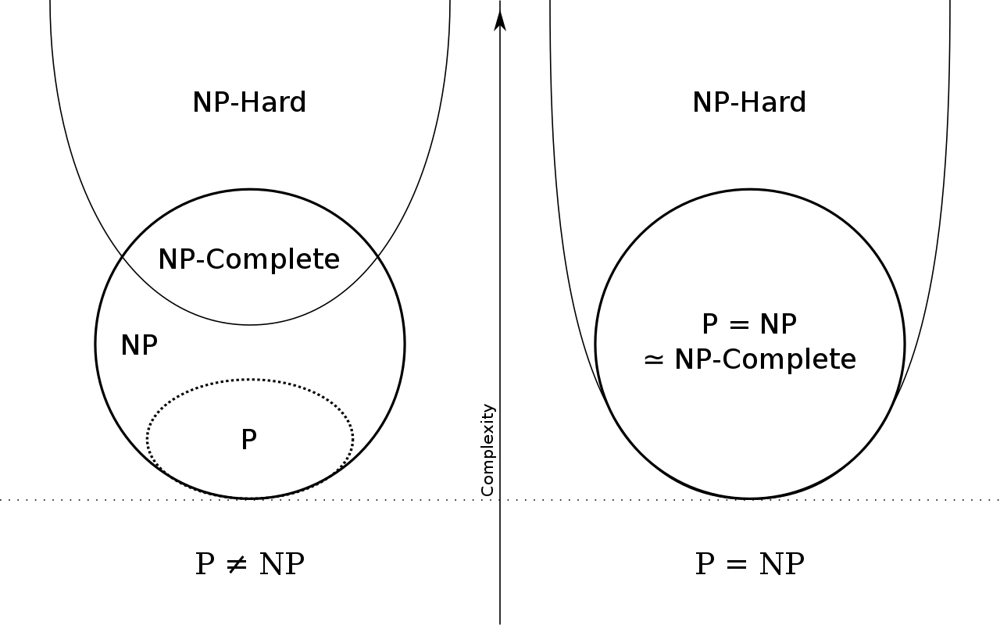

### Big-O $$O(n)$$

> $$O(n)$$ looks at **best cases.** $$f(n) = O(g(n))$$ if
>
> $$
> \begin{align}
> &f(n) \leq g(n) \cdot c,& &\text{for all } n \geq n_0, n \in \mathbb{N}& \\
> && &\text{with some positive} \\
> && &\text{constants } c \text{ and } n_0
> \end{align}
> $$
>

This means that $$g(n)\cdot c$$ will always be greater than or equals to $$f(n)$$ after a certain threshold $$n_0$$. You can think of it as a upper bound to $$f(n)$$, where you’re saying that $$f(n)$$ cannot get any “worse/slower” than this.

### Big-Omega $$\Omega(n)$$

> $$\Omega(n)$$ looks at **best cases.** $$f(n) = \Omega(g(n))$$ if
>
> $$
> \begin{align}
> &f(n) \ge g(n) \cdot c,& &\text{for all } n \geq n_0, n \in \mathbb{N}& \\
> && &\text{with some positive} \\
> && &\text{constants } c \text{ and } n_0
> \end{align}
> $$
>

This means that $$g(n)\cdot c$$ will always be lesser than or equals to $$f(n)$$ after a certain threshold $$n_0$$. You can think of it as a lower bound to $$f(n)$$, where you’re saying that $$f(n)$$ cannot get any “better/faster” than this.

### Big-Theta $$\Theta(n)$$

> $$\Theta(n)$$ looks at **average cases.** We say that $$f(n) = \Theta(g(n))$$ when $$f(n)$$ is asymptotically **equal to** $$g(n)$$, this happens if and only if
>
> $$
> f(n) = \Theta(g(n)) \iff f(n) = O(g(n)) \land f(n) = \Omega(g(n)) \\
> \begin{align}\\
> &g(n)\cdot c_\Omega \le f(n) \le g(n) \cdot c_O,& &\text{for all } n \geq n_0, n \in \mathbb{N}& \\
> && &\text{with some positive} \\
> && &\text{constants } c_O, c_\Omega, \text{ and } n_0
> \end{align}
> $$
>

Here this means that for a specific $$g(n)$$, we can scale it by two variables $$c_O$$ and $$c_\Omega$$ and $$f$$ will be always “fit in-between” the two scaled $$g$$s after a certain threshold $$n_0$$.


## Greedy algorithms

Greedy algorithms don't have a formal definition, but are captured by the notion of only considering each item once and independently from all other items, deciding whether to accept or reject it, for each item in the input in the order of a greedy rule. The correctness of the algorithm relies on the correctness of the greedy rule (order of processing).

> Process the input in some order, and myopically and independently make irrevocable decisions about whether to accept or reject the input item


andbe in that order
S <- {}
FOR j <- 1 TO N
	IF input[j] satisfies the problem with all other items in S
		ADD input[j] to S
	ENDIF
ENDFOR
```

In order to implement this, we need to devise a "greedy rule". Picking these can be tricky, with no definitive process for it - just trial and error/intuition.

### Proof of correctness strategies

#### 1."Greedy algorithm stays ahead"

After each step, show that the output of the greedy algorithm is at least as good as any other argument.

Example

#### 2. Structural

Find a structural property (called a bound) that all valid solutions must have, then show that the greedy algorithm always satisfies it.

Example

#### 3. Exchange argument

Gradually transform any solution to the one found by the greedy algorithm without hurting its quality.

Example


## Divide and conquer algorithms

The key idea behind divide and conquer algorithms is the three steps:

1. Divide the problem into disjoint subproblems of the same kind
2. Solve the subproblems recursively
3. Combine the subproblems together to form a solution

### Assessing the speed of divide and conquer algorithms

Consider an algorithm which creates two subproblems, each of half the size, and takes linear time to recombine them

#### Recursive definition

We can express a recursive expression for their time complexity as follows:
$$
T(n) \leq
\begin{cases}
    0, & \text{if}\ n=1 \\
    2 \cdot T(n/2) + n, & \text{otherwise}
\end{cases}
$$

This allows us to take a problem which would take $$\Theta(n^2)$$ time to brute force, and solve it in $$O(n\ log\ n)$$ time

#### Drawing recursive trees


#### Master theorem

A "recipe for solving common divide and conquer recurrences" - recursive expressions of the form:

$$
T(n) =
\begin{cases}
    0, & \text{if}\ n=1 \\
    a \cdot T(n/b) + \Theta(n^c), & \text{otherwise}
\end{cases} \\
T(1) = \Theta(1) \quad\quad\quad\quad\quad\quad\quad\quad\quad\quad\quad\quad
$$

Where:

- $$a \geq 1$$ is the number of subproblems
- b $$\geq 2$$ is the factor by which the subproblem size decreases (this also allows for $$\lceil \frac{n}{b} \rceil$$ and $$\lfloor \frac{n}{b} \rfloor$$ in the place of $$\frac{n}{b}$$)
- $$n^c\ ,\  \exists c > 0$$ is the work needed to combine the subproblems back together into a solution

This then has solutions in the three different cases:

- If $$c < log_b\ a$$, then $$T(n) = \Theta(n^{log_b\ a})$$
- If $$c = log_b\ a$$, then $$T(n) = \Theta(n^c\ log\ n)$$
- If $$c > log_b\ a$$, then $$T(n) = \Theta(n^c)$$

This can also be extended in the following ways:

- The $$\Theta$$ can be replaced with $$O$$ and $$\Omega$$ in all cases
- The initial conditions can be replaced with $$T(n) = \Theta(1)\ ,\  \forall n \leq n_0$$, and only require the recurrence to hold for $$n > n_0$$


## Dynamic programming

The key idea behind dynamic programming algorithms is the three steps:

1. Break up the problem into a series of overlapping subproblems
2. Solve the subproblems
3. Combine the subproblems together to form a solution

It is "a fancy name for caching intermediate results in a table for later re-use".


Two components:

- Subproblems
- Optimal substructure


The $$OPT$$ equation


### Memoization

The idea of caching the results of the $$OPT$$ function if they have already been evaluated, so they needn't be re-computed


### Top-down recursion

### Bottom-up recursion


## Intractability

Problems solvable in at most polynomial time are considered tractable


### Polynomial time reductions

A problem $$X$$ "polynomial time reduces" to a problem $$Y$$ if arbitrary instances of $$X$$ can be solved with:

- A polynomial number of computational steps
- A polynomial number of calls to an "oracle", which solves $Y$ in constant time


We refer to this reduction as $$X \leq_p Y$$ (read polynomial reduction of $$X$$ to $$Y$$)

If $$X \leq_p Y$$, then if $$Y$$ is solvable in polynomial time, then $$X$$ must be too, and vice versa.

If $$X \leq_p Y$$ and $$Y \leq_p X$$, then we say $$X \equiv_p Y$$, which means $$X$$ is solvable in polynomial time iff $$Y$$ is too.

Reductions are also transitive, so $$X \leq_p Y \text{ and } Y \leq_p Z \implies X \leq_p Z$$ - which is intuitively clear, as we can just compose together reductions to get along the chain


### Complexity classes of algorithms

For these definitions, we restrict ourselves to decision (yes/no) problems for convenience. We can then say:

- A problem $$X$$ is a set of strings and an instance $$s$$ is one string

- An algorithm $$A$$ solves this problem if:
  $$
  A(s) =
  \begin{cases}
      yes, & \text{if}\ s \in X \\
      no, & \text{if}\ s \notin X
  \end{cases}
  $$


#### P

An algorithm $$A$$ runs in polynomial time if for every string $s$, then $$A(s)$$ terminates in fewer than $$p(\vert s \vert)$$ steps, where $$p$$ is some polynomial function. This can be expressed as $$P$$ is the set of decision problems for which there exists a polynomial time algorithm to find the solution.

#### NP

To define the NP class of problem, we first need some more vocabulary:

- A certificate $$t$$ refers to a string of length at most $$P(n)$$ which can help check whether a problem instance is true or false. For example, this could be a factor of the number which allows checking if a number is composite by simple division, or the subset which sums to the target which allows checking if a subset sum is possible by summation.

- An algorithm $$C(s,t)$$ is a certifier for problem $$X$$ if for every string $$s$$, $$s \in X$$ iff there exists a string $$t$$ (the certificate) such that $$C(s,t) = yes$$. This can be expressed as saying a certifier is an algorithm that always correctly checks whether a problem instance is correct given a certificate.

- A problem is said to be NP if there exists a polynomial time algorithm $$C(s,t)$$, where the certificate $$t$$ is of polynomial size $$\vert t \vert \leq p(\vert s\vert )$$ for some polynomial function $$p$$

#### EXP

A problem is said to be EXP if there exists an exponential time algorithm to solve it

#### NP-Hard

#### NP-Complete

### P vs NP

It is not known whether P fully encompasses NP - this is a big unsolved problem in computer science. The diagrams of the above classes look like the following for P=NP and P$\ne$NP respectively:




### Showing NP-completeness

1. Show NP-Hardness
   - Prove reduction from a known NP-Hard problem to it
2. Show NP
   - Show that there exists a valid certifier in polynomial time


