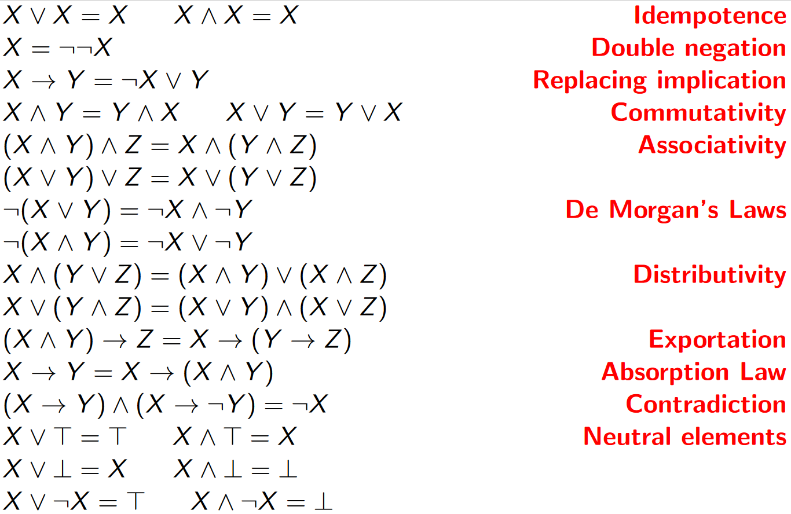
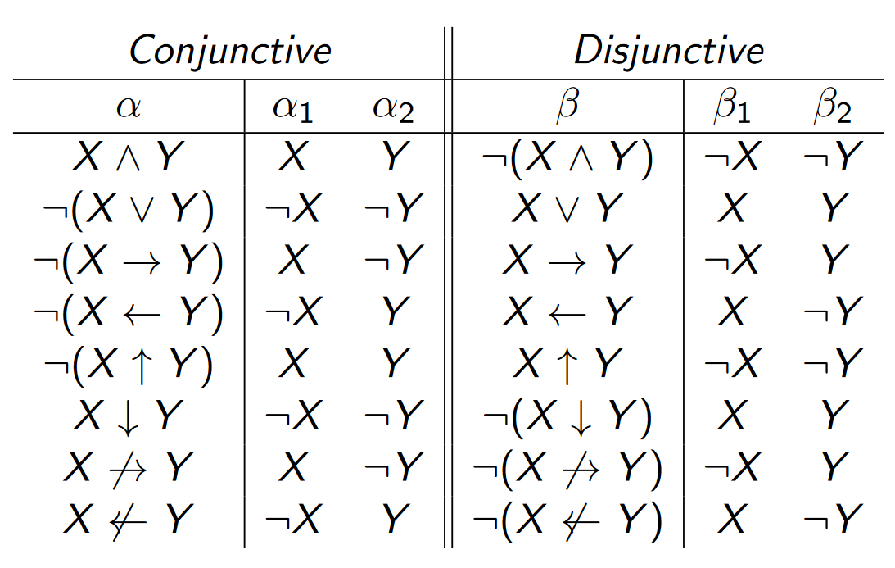
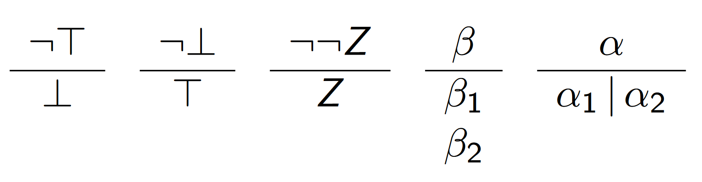
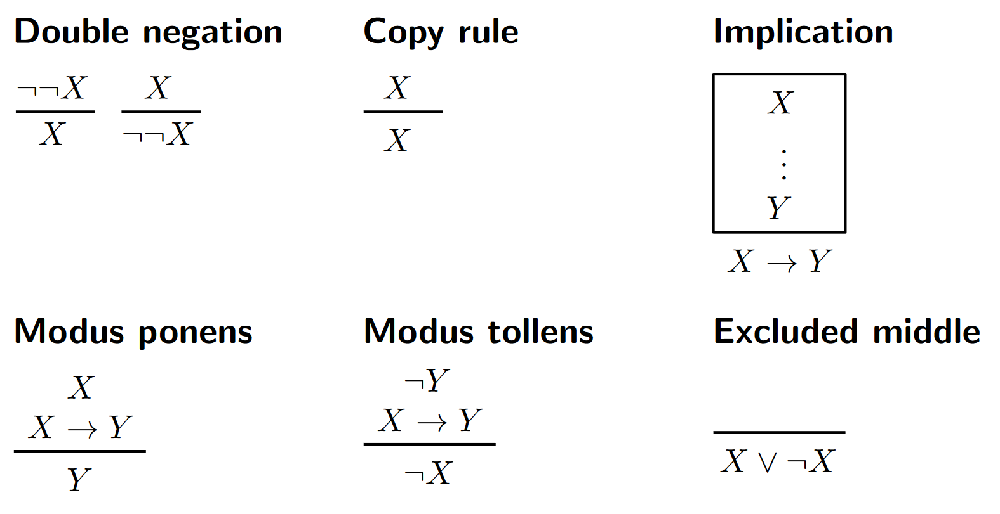

## Logic crib sheet

### Parse trees

### Propositional consequence

We say that a formula $$X$$ is a **consequence** of a set $$S$$ of formulas, denoted $$S \vDash X$$ , provided that $$X$$ maps to $$T$$ under every valuation that
maps every member of $$S$$ to $$T$$ .

X is a tautology if and only if $$\empty \vDash X$$ , which we write as $$\vDash X$$.

### Boolean algebra laws

### $$\alpha$$ and $$\beta$$ formula

### Generalised operands

#### Generalised disjunction

- $$[X_1, X_2, ..., X_n] = X_1 \vee X_2 \vee ... \vee X_n$$

- $$v([X_1, X_2, ..., X_n]) = T$$ if and only if $$v(X_i) = T, \quad \exists V_i$$
- $$v([]) = v(\bot) = F$$

#### Generalised conjunction

- $$\langle X_1, X_2, ..., X_n \rangle = X_1 \wedge X_2 \wedge ... \wedge X_n$$

- $$v(\langle X_1, X_2, ..., X_n \rangle) = T$$ if and only if $$v(X_i) = T, \quad \forall V_i$$
- $$v(\langle \rangle) = v(\bot) = F$$

### Normal forms

#### Disjunctive normal form

Start with $$\langle [X] \rangle$$, then repeatedly apply the following rules to the expression, terminating when only literals remain:

#### Conjunctive normal form

Start with $$[ \langle X \rangle ]$$, then repeatedly apply the following rules to the expression, terminating when only literals remain:

### Proof systems

#### Semantic tableau expansion

Start with $$\neg X$$ as the root node, as it is a refutation system, and we are looking for contradictions.

In each step, select a branch and a non-literal formula on that branch, then apply the following rules (same as DNF):

A closed branch is when either both $$N$$ and $$\neg N$$, or $$\bot$$ occur on a branch. If all branches of the expansion are closed, the algorithm terminates.

A tableau is called strict if each vertex in the tree only has one rule applied to it.

A tableau proof of $$X$$ is a closed tableau for $$\neg X$$, and we write $$\vdash_t X$$ to denote this.

#### Resolution expansion

Start with $$\neg X$$ as the first disjunction, as it is a refutation system, and we are looking for contradictions.

In each step, select a disjunction and a non-literal formula $$N$$ within it, then apply the following rules to $$N$$ (same as CNF):

- $$\beta$$-expansion = split into two elements within the disjunction

- $$\alpha$$-expansion = add two new lines

There is another rule called the resolution rule.

> Suppose $$D_1$$ and $$D_2$$ are two disjunctions, with $$N$$ occurring in $$D_1$$ and $$\neg N$$ in $$D_2$$.
>
> Let $$D$$ be the result of the following:
>
> 1) Delete all occurrences of $$N$$ from $$D_1$$
> 2) Delete all occurrences of $$\neg N$$ from $$D_2$$
> 3) Combine the resulting disjunctions
>
> Finally, add $$D$$ as a new line in the proof
>
> There is a special case of when a disjunction $$D$$ contains $$\bot$$, in which case remove all instances of $$\bot$$ from the $$D$$

A resolution is called strict if each disjunction in the proof only has one rule applied to it.

A resolution proof of $$X$$ is a closed resolution for $$\neg X$$, and we write $$\vdash_r X$$ to denote this.

#### Natural deduction

A system of ____, with sub-ordinate proofs (lemmas), enclosed within boxes, which can then be used later in the proof.

The first formula in a box is an assumption, which is taken as axiomatic, only within the scope of that.

The following rules can be applied:

Proof strategies:

- Work inwards from both the start and the end
- Split an implication $$X \rightarrow Y$$, by assuming $$X$$, then showing $$Y$$ can be deduced from it, hence by ___ $$X \rightarrow Y$$
- Assume the $$\neg X$$, show that $$\bot$$ can be deduced from it, hence $$X$$

We write $$\vdash_d X$$ to denote a natural deduction proof of $$X$$

#### S-introduction

The above proof methods just prove tautologies. These allow us to prove propositional consequences by "introducing" premises from a proposition $$S$$.

##### Semantic tableau

Any formula $$Y \in S$$ can be added to the end of any tableau branch. We write $$S \vdash_t X$$ if there is a closed tableau for $$\neg X$$ from $$S$$, allowing the S-introduction rule for tableau.

##### Resolution

For any formula $$Y \in S$$, the line $$[ Y ]$$ can be added as a line to a resolution expansion. We write $$S \vdash_r X$$ if there is a closed resolution expansion for $$\neg X$$ from $$S$$, allowing the S-introduction rule for resolution.

##### Natural deduction

For any formula $$Y \in S$$, the line $$Y$$ can be added as a line anywhere within the natural deduction. We write $$S \vdash_d X$$ if there is a natural deduction derivation for $$X$$ from $$S$$ , allowing the S-introduction rule for resolution.

